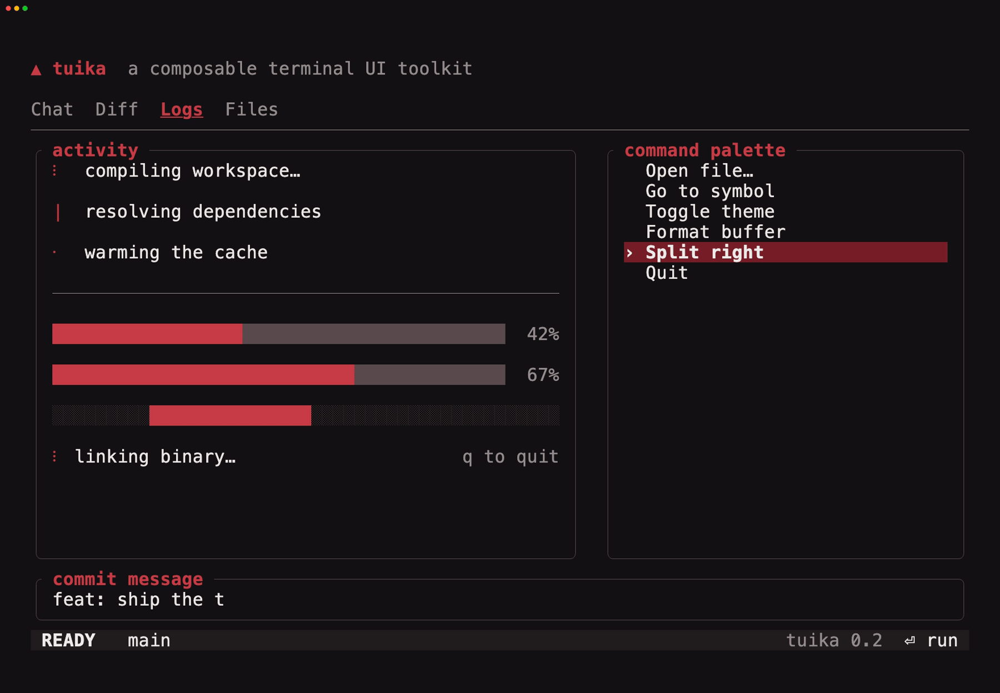
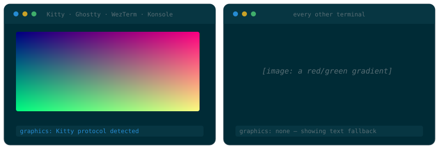

# tuika

<div align="center">

[](https://crates.io/crates/tuika)
[](https://docs.rs/tuika)
[](https://crates.io/crates/tuika)
[](https://github.com/everruns/tuika/blob/main/LICENSE)
 \
[Docs](https://docs.rs/tuika) · [Components](docs/components.md) ·
[Markdown](docs/markdown.md) · [Terminal features](docs/features.md) ·
[Keymap](docs/keymap.md) · [Styling](docs/styling.md) ·
[Themes](docs/themes.md) \
[Showcases](docs/showcases.md) · [Examples](#runnable-examples) ·
[Changelog](CHANGELOG.md) · [Contributing](CONTRIBUTING.md) ·
[Report a bug](https://github.com/everruns/tuika/issues)

</div>

<p align="center">
  
</p>

<div align="center">

### tuika's goal is to become the default TUI [application](./docs/showcases.md) framework for Rust

**Build the app, not the render loop.**

</div>

<details>
<summary>Table of contents</summary>

- [Install](#install)
- [Model](#model)
- [Crate layout](#crate-layout)
- [Components](#components)
- [Example](#example)
- [Owned scenes, dialogs, and forms](#owned-scenes-dialogs-and-forms)
- [Markdown and syntax highlighting](#markdown-and-syntax-highlighting)
- [Theming](#theming)
- [Runnable examples](#runnable-examples)
- [Declarative DSL (`view!`)](#declarative-dsl-view)
- [Ratatui interoperability](#ratatui-interoperability)
- [Screen modes, lifecycle, and runner](#screen-modes-lifecycle-and-runner)
- [Images](#images)
- [Mouse, selection, and clipboard](#mouse-selection-and-clipboard)
- [Testing your UI](#testing-your-ui)
- [Used in](#used-in)
- [Compatibility](#compatibility)
- [Extending](#extending)
- [License](#license)

</details>

`ratatui` gives you a cell buffer and widgets to draw into it; everything above
that — layout, overlays, focus, input, the terminal lifecycle — has been left to
each application to build for itself. tuika is that missing layer, and wants to
be the standing answer to "what do I build a Rust TUI *application* on?": start
with `cargo add tuika`, describe your screen, and get a real app instead of a
render loop.

You write views; tuika owns the rest:

- **A whole app, not a widget set** — [flexbox layout](#model), anchored
  [overlays](#owned-scenes-dialogs-and-forms), focus, a declarative
  [keymap](docs/keymap.md), [themes and stylesheets](#theming), and a
  [runner](#screen-modes-lifecycle-and-runner) that owns raw mode, the alternate
  screen (or a [split footer](#screen-modes-lifecycle-and-runner) over live
  scrollback), and event translation.
- **Batteries the terminal era expects** — [30+ components](#components)
  including streaming [Markdown](docs/markdown.md) with pluggable syntax
  highlighting, [images](#images) over Kitty/iTerm2/Sixel, mermaid diagrams,
  [mouse selection and clipboard](#mouse-selection-and-clipboard), and
  [native OSC 9;4 progress](#native-terminal-progress).
- **No lock-in** — it is additive to ratatui, not a replacement: wrap any
  ratatui widget in [`RatatuiView`](#ratatui-interoperability) and it composes
  like a built-in, and your own types implement the same `View` trait the
  built-ins do (see [Extending](#extending)).
- **Boring where it counts** — no reconciler, no retained tree, no runtime, no
  macro DSL you are forced into. Views are rebuilt each frame and `ratatui`
  diffs the buffer. Rendering is deterministic, so
  [UI is unit-tested](#testing-your-ui) against an in-memory buffer with no
  terminal at all.
- **Small enough to adopt without a second thought** — a self-contained crate
  depending only on `ratatui-core` (plus `ratatui-crossterm` for the backend),
  `crossterm`, `textwrap`, `unicode-segmentation`, `unicode-width`, and
  `pulldown-cmark`. Anything heavy — grammars, diagram layout, image decoding —
  lives behind a trait in a companion crate or your host.

It is host-agnostic: it knows nothing about the application embedding it, and no
type, feature, or default exists to serve one host. tuika renders none of
ratatui's own widgets, so it builds against `ratatui-core` directly rather than
the `ratatui` umbrella — keeping `ratatui-widgets`, `ratatui-macros`, and their
transitive weight out of its dependency tree. Your application still uses any
ratatui widget it likes (see [Compatibility](#compatibility)). (The optional
`async` feature adds Tokio for [`AsyncRunner`](#screen-modes-lifecycle-and-runner);
it is off by default.)

See what that buys in practice: the [showcases](docs/showcases.md) are
recordings of real applications running on tuika (also listed under
[Used in](#used-in)), and the [`codex` example](examples/codex) is a whole
coding-agent UI built with nothing else.

## Install

```bash
cargo add tuika
```

`ratatui` and `crossterm` are part of `tuika`'s public interoperability
surface, so add `ratatui` to your own crate and pin a compatible minor version.
tuika depends on `ratatui-core`, which the `ratatui` umbrella re-exports, so
Cargo unifies the shared `Buffer`/`Rect`/`Style` types and your widgets compose
with tuika's surfaces (see [Compatibility](#compatibility)).

## Model

- **Views** (`view::View`) are rebuilt from application state every frame. This
  is cheap because `ratatui` diffs the resulting cell buffer, so there is no
  reconciler.
- **State** that must survive across frames — scroll offset, selection index,
  focus — lives in host-persisted `*State` structs (the `StatefulWidget`
  idiom), not in the view tree.
- **Live data** (`Live` / `LiveView`) is shared application state read at render
  time. Updates request a redraw from the runner; Tuika does not spawn data
  sources or reconcile a retained widget tree.
- **Layout** is a flexbox subset (`layout`): `Dimension` (`Auto`/`Fixed`/
  `Percent`/`Flex`), `Align`, `Justify`, `Direction`, over a direction-agnostic
  axis so rows and columns share one solver.
- **Overlays** (`overlay`) anchor a view over the base tree; the **host**
  (`host`) owns the alternate screen, translates crossterm input, and
  composites the frame.
- **Keymap** ([`keymap`](docs/keymap.md)) resolves declarative key bindings to
  named commands: chords (`ctrl+r`) and multi-stroke sequences (`g g`) grouped
  into prioritized, mode-gated `Layer`s, dispatched from a translated `Key` and
  queryable for help/`KeyHints` surfaces. Host-agnostic, so it unit-tests
  without a terminal. See the [keymap guide](docs/keymap.md).
- **Motion** (`anim`, `components::{Spinner, ProgressBar, Loader}`,
  `term::progress::TerminalProgress`) animates from a host-supplied frame counter and
  can drive the terminal's own OSC 9;4 progress indicator. `anim::Timeline` adds
  a scheduler-free keyframe track (values eased over frame offsets, with
  looping/ping-pong) sampled purely from that counter.
- **Pixels** (`framebuffer`) — a mutable RGBA `FrameBuffer` the host draws into
  (`set`/`blend`/`fill_rect`/`blit`, a per-pixel `shade` shader post-pass, and
  `Sprite` spritesheet frames). `FrameBufferView` paints it into cells with
  half-blocks on any terminal, or hand `to_image_data()` to the crisp graphics
  protocols.

## Crate layout

Four places, so you can guess where something is:

| Path | Holds |
| --- | --- |
| `tuika::` | the framework spine — `View`, `Element`, `RenderCtx`, layout, events, `Theme`, `Surface`, the host seam |
| `tuika::components` | every widget: `Flex`, `Boxed`, `Text`, `Scroll`, `Markdown`, `Table`, … |
| `tuika::term` | everything out-of-band: `clipboard` (OSC 52), `hyperlink` (OSC 8), `progress` (OSC 9;4), `pointer` (OSC 22), `image`, `capabilities`, `palette` (the terminal's own colors) |
| `tuika::prelude` | the spine and the components in one glob import |

Application code usually wants the prelude:

```rust
use tuika::prelude::*;
```

Everything else stays behind its module path on purpose — `themes::by_name`,
`probe::RectProbe`, `width::str_cols`, `term::clipboard::write` — so a short
path always means "you will use this constantly".

## Components

See the [component gallery](docs/components.md) for an animated demo of each
component. Linked names below jump straight to their demo.

| Component | Purpose |
| --- | --- |
| [`Text`](docs/components.md#text) / `Paragraph` | Styled lines / word-wrapped plain text |
| `Wrap` | Word-wraps pre-styled lines, preserving per-span styles |
| [`Markdown`](docs/markdown.md) (+ `MarkdownState`) | CommonMark → styled lines; `MarkdownState` streams incrementally — see the [markdown guide](docs/markdown.md) |
| [`CodeBlock`](docs/components.md#codeblock) | Themed, framed code block with a pluggable `Highlighter` and optional line-number gutter |
| [`Html`](docs/components.md#html) | HTML fragment → styled lines (companion crate [`tuika-html`](crates/tuika-html/)) |
| `Diff` | Line diff (LCS), unified or side-by-side, with `+`/`-` gutters and line numbers |
| `AsciiFont` | Large "figlet-style" block-letter banner text |
| `QrCode` (+ `QrEcc`) | QR code (byte-mode v1–4 encoder) rendered with half-blocks |
| [`Rule`](docs/components.md#rule) | Horizontal separator: optional title + fill glyph to width |
| [`Flex`](docs/components.md#flex) | Flexbox container (the composition primitive) |
| `Responsive` / `Constrained` | Breakpoint selection and min/max measurement |
| [`Boxed`](docs/components.md#boxed) | Border + padding + title, focus-aware |
| `Scene` / `ScopedScene` / `Dialog` | Owned or frame-borrowed root + anchored overlays |
| `Spacer` | Flexible filler |
| [`Scroll`](docs/components.md#scroll--scrollstate) (+ `ScrollState`) | Vertical scroll viewport + scrollbar over lines |
| [`ItemScroll`](docs/components.md#itemscroll) | The same viewport over laid-out items (panels, tables, nested layouts) |
| `Viewport` | Two-dimensional clipping/panning over any child view |
| `Form` / `FormField` (+ `FormState`) | Responsive labeled controls and validation |
| `DrawView` / `CanvasView` | Closure-based custom cell drawing |
| [`SelectList`](docs/components.md#selectlist--selectstate) (+ `SelectState`) | Selectable list |
| `Slider` (+ `SliderState`) | One-row value picker over a numeric range |
| [`TextInput`](docs/components.md#textinput--textinputstate) (+ `TextInputState`) | Multi-line composer: soft-wrap, placeholder, highlighted ranges, `@`/`/` tokens |
| [`StatusBar`](docs/components.md#statusbar) | One-row left/right status segments |
| [`Tabs`](docs/components.md#tabs--tabsstate) / `KeyHints` | Host-state tab navigation and command hints |
| `TabSelect` (+ `TabSelectState`) | Value-selecting segmented control |
| `Toasts` / `ToastList` | Transient notification stack with frame-driven expiry |
| `Console` (+ `ConsoleLog`) | Captured stdout/log ring buffer + tailing overlay view |
| [`Spinner`](docs/components.md#spinner) | Frame-cycled activity glyph |
| [`ProgressBar`](docs/components.md#progressbar) | Determinate (sub-cell) / indeterminate bar |
| [`Loader`](docs/components.md#loader) | Spinner + message + hint row |

## Example

Layout reads top-down with the [`view!`](#declarative-dsl-view) DSL:

```rust
use tuika::prelude::*;

let theme = Theme::default();
let root = view! {
    col(gap = 1) {
        fixed(1) { node(Spinner::new(frame)) }
        fixed(1) { node(ProgressBar::determinate(0.6).percent(true)) }
        grow(1) { text("body") }
    }
};

// In a `terminal.draw(|f| ...)` closure:
paint(f.buffer_mut(), f.area(), &theme, root.as_ref(), &[]);
```

## Owned and scoped scenes, dialogs, and forms

`Scene` owns a root `Element` and ordered `SceneOverlay`s. Each layer retains
its `OverlaySpec`, so it resolves against the current terminal size inside
rendering; callers do not retain pre-resolved `Rect`s.
`Dialog` composes `Boxed`, `Flex`, and optional `KeyHints` into a centered modal
with size clamps, clear/dim behavior, and an optional focus-owner id:

```rust
use tuika::prelude::*;

let scene = Scene::new(element(base)).dialog(
    Dialog::new("Confirm", element(Text::raw("Delete this item?")))
        .min_size(30, 7)
        .max_size(70, 20)
        .key_hints([("enter", "delete"), ("esc", "cancel")])
        .dim_backdrop(true)
        .focus_owner("confirm"),
);
scene.sync_focus(&mut focus);
paint_scene(buffer, area, &theme, &scene);
```

`Element` is an owned, boxed view. When the base view reads a large host-owned
model directly, `ScopedScene` borrows that concrete root for one paint while
continuing to own ordinary `SceneOverlay`s and `Dialog`s:

```rust
use ratatui_core::layout::Rect;
use tuika::prelude::*;

struct Dashboard<'a> {
    messages: &'a [String],
}

impl View for Dashboard<'_> {
    fn measure(&self, available: Size) -> Size {
        available
    }

    fn render(&self, area: Rect, surface: &mut Surface, ctx: &RenderCtx) {
        for (row, message) in self.messages.iter().take(area.height as usize).enumerate() {
            surface.set_string(area.x, area.y + row as u16, message, ctx.theme.text_style());
        }
    }
}

let dashboard = Dashboard { messages: &app.messages };
let scene = ScopedScene::new(&dashboard).dialog(
    Dialog::new("Confirm", element(Text::raw("Delete this item?")))
        .dim_backdrop(true)
        .focus_owner("confirm"),
);
scene.sync_focus(&mut focus);
paint(buffer, area, &theme, &scene, &[]);
```

The borrow lasts only as long as the scoped scene, matching Tuika's
frame-by-frame view model. No transcript clone, leaked allocation, or
application compositor is needed. Nested component children are still owned
`Element`s; when a whole borrowed subtree is needed, represent that subtree as
one concrete `View` and use it as the scoped root.

`Form` lays out arbitrary control `Element`s beside responsive labels, stacking
on narrow terminals. Help and validation rows are built in; `FormState` owns
only focus traversal and submit/cancel outcomes, while values and cursor state
stay in existing host-owned `TextInputState`, `SelectState`, or application
models.

## Arbitrary-child viewports and drawing

`Viewport` clips and pans any child view in both axes. The host supplies the
full content `Size` and mirrors offsets through the same `ScrollState` used by
line-oriented `Scroll`. It renders only the visible source window, so a large
logical canvas does not allocate a full off-screen buffer.

`DrawView` (also named `CanvasView`) turns a closure receiving `(Rect,
&mut Surface, &RenderCtx)` into a normal view. The surface is already clipped,
making it suitable for terminal grids, charts, emulators, and incremental
migrations. Import it explicitly from `tuika::view`; custom canvases stay
outside the application prelude.

Run `cargo run --example primitives` for one composition using `Scene`,
`Dialog`, `Form`, `Viewport`, and `DrawView`.

### Builder syntax (alternative)

`view!` expands to plain builder calls, so the same tree can be written without
the macro:

```rust
use tuika::prelude::*;

let root = Flex::column()
    .gap(1)
    .fixed(1, element(Spinner::new(frame)))
    .fixed(1, element(ProgressBar::determinate(0.6).percent(true)))
    .grow(1, element(Text::raw("body")));
```

## Markdown and syntax highlighting

`Markdown` renders CommonMark to styled lines, word-wrapping prose while drawing
code and tables verbatim. `MarkdownState` is its streaming form: fed deltas as a
message arrives, it re-parses only the in-flight tail and caches everything
before the last stable block boundary, so long transcripts don't re-tokenize and
settled code blocks aren't re-highlighted every frame.

Highlighting is a seam, not a dependency: `tuika` owns the *presentation* of code
(framing, background, language label, wrapping) via `CodeBlock`, and takes token
colors from any `Highlighter` you supply — keeping the toolkit free of grammar
crates. The companion crate
[`tuika-codeformatters`](https://crates.io/crates/tuika-codeformatters) ships a
ready-made tree-sitter `Highlighter`.

Fenced blocks can replace their source with a different, width-aware
presentation through `FencedBlockRenderer`. The
[`tuika-mermaid`](crates/tuika-mermaid/) companion uses that seam with mmdflux:
a `mermaid` fence becomes a Unicode cell diagram inside the surrounding
Markdown, with no browser, SVG, or image protocol. Unsupported or invalid input
falls back to the ordinary code block.

```rust
use tuika::prelude::*;
use tuika_mermaid::MermaidRenderer;

let mermaid = MermaidRenderer::new();
let document = Markdown::new(
    "```mermaid\nflowchart LR\n  Parse --> Layout --> Paint\n```",
)
.block_renderer(&mermaid);
# let _ = document;
```

Run the complete integration demo with
`cargo run -p tuika-mermaid --example mermaid_markdown`.


Images use the same host-extension pattern: supply an `ImageResolver` and
`` renders as real pixels (see [Images](#images)).

Markdown in the wild carries HTML. The presentational inline tags — `<b>`,
`<em>`, `<code>`, `<kbd>`, `<mark>`, `<a>`, `<br>`, `<sub>`/`<sup>` — render in
tuika itself, each through the same `StyleSheet` role as the markdown it
mirrors. Block-level HTML is a seam, for the same reason highlighting is: an
HTML parser is a dependency tuika will not carry. Attach an `HtmlBlockRenderer`
and `<details>`, `<table>`, and `<div>` lay out too.
[`tuika-html`](crates/tuika-html/) is the ready-made one, and it also supplies
the [`Html`](docs/components.md#html) component for markup that is not inside
markdown at all. See the markdown guide for
[inline HTML](docs/markdown.md#inline-html) and
[block HTML](docs/markdown.md#block-html).

## Theming

Every component styles itself from a `Theme` passed through the render context —
no color is hard-coded, so swapping the theme handed to `paint` restyles the
whole tree at once. A `Theme` is a plain `Copy` struct of colors, and tuika
bundles a few standard palettes as full `const Theme` structures in the
[`themes`](https://docs.rs/tuika/latest/tuika/themes/index.html) module —
reachable directly, by constructor, or by name:

```rust
use tuika::themes;

let a = themes::GRUVBOX_DARK;                          // the struct
let b = tuika::Theme::gruvbox_dark();                  // named constructor
let c = tuika::themes::by_name("gruvbox-dark").unwrap(); // config / --theme
```

See the [theme gallery](docs/themes.md) for a screenshot of each bundled
palette, or `themes::PRESETS` to enumerate them for a picker.

An app can also inherit the palette the user already configured in their
terminal, rather than bringing its own — either implicitly with `themes::TERMINAL`
(ANSI slots, no I/O) or by asking the terminal for its actual colors and deriving
a full theme from the reply. It is opt-in: tuika never probes unless a host asks
it to. The query lives with the other out-of-band escapes, in `term::palette`. See
[inheriting the terminal's colors](docs/features.md#inheriting-the-terminals-colors).

Where a `Theme` is the color *tokens*, a `StyleSheet` is the *rules* — a mapping
from a semantic role (heading, link, inline code, a panel's border and fill, …)
onto the style it draws with. Override a role in one place and every element with
that role restyles at once; markdown parts and bare URLs are role-driven too. See
the [styling guide](docs/styling.md).

## Runnable examples

Each takes over the terminal — the alternate screen, or a pinned footer for
[`split_footer`](examples/split_footer.rs); press `q` (or `esc`) to quit.

| Example    | Command                                   | Shows                                              |
| ---------- | ----------------------------------------- | -------------------------------------------------- |
| [`gallery`](examples/gallery.rs)  | `cargo run --example gallery`    | motion components + native OSC 9;4 progress        |
| [`markdown`](examples/markdown.rs) | `cargo run --example markdown`   | streaming `MarkdownState` + highlighted `CodeBlock`, following the stream until you scroll back |
| [`select`](examples/select.rs)   | `cargo run --example select`     | `SelectState` + `SelectList` (stateful-widget idiom) |
| [`overlay`](examples/overlay.rs)  | `cargo run --example overlay`    | `OverlaySpec` centered dialog + input routing      |
| [`primitives`](examples/primitives.rs) | `cargo run --example primitives` | owned dialog scene + form + arbitrary-child viewport |
| [`ratatui_dashboard`](examples/ratatui_dashboard.rs) | `cargo run --example ratatui_dashboard` | mixed Ratatui widgets + responsive live data |
| [`async_dashboard`](examples/async_dashboard.rs) | `cargo run --example async_dashboard --features async` | `AsyncRunner` polling on a Tokio runtime, no shared state |
| [`mouse`](examples/mouse.rs)     | `cargo run --example mouse`      | drag-to-select + highlight + OSC 52 copy, clickable buttons |
| [`image`](examples/image.rs)     | `cargo run --example image`      | `Image` over reserved cells (Kitty/iTerm2/Sixel), alt-text fallback |
| [`inherit`](examples/inherit.rs) | `cargo run --example inherit`    | adopting the terminal's own palette — probe, derive, and the no-I/O fallback |
| [`split_footer`](examples/split_footer.rs) | `cargo run --example split_footer` | a pinned footer over live terminal scrollback, published through `Scrollback` |
| [`codex`](examples/codex)        | `cargo run --example codex`      | a scripted Codex CLI interface replica: streaming transcript, composer, `@`/`/` pickers, approval prompt |
| [`codex --split-footer`](examples/codex) | `cargo run --example codex -- --split-footer` | the same agent UI with its transcript published into the terminal's own scrollback |

Each of the single-topic examples above quits on `q`/`esc`. [`codex`](examples/codex)
is the composite one — those keys are text there, so it quits with `⌃C` — and it
prints canned frames without a terminal at all with
`cargo run --example codex -- --dump`.

## Declarative DSL (`view!`)

`view!` is optional sugar over the builders — it expands to the exact same
`Flex`/`Boxed`/`element(...)` calls, so there is no runtime cost and nothing new
in the model. It just makes nested layout read top-down:

```rust
let root = crate::view! {
    col(gap = 1, padding = tuika::Padding::all(1)) {
        boxed(title = " body ") { text("hello") }
        grow(1) { spacer() }
        node(status_bar)          // any expression that is `impl View`
    }
};
```

Grammar (each keyword consumes exactly one node):

- `col(attrs) { … }` / `row(attrs) { … }` — flex containers. Attrs (all
  optional): `gap`, `padding`, `align`, `justify`, `background`.
- `boxed(attrs) { child }` — bordered container. Attrs: `title`, `border`,
  `padding`, `background`.
- `text(expr)`, `spacer()` — leaves.
- `grow(n) { node }` / `fixed(n) { node }` — set a child's main-axis size
  (default auto).
- **`node(expr)`** — splice any `impl View`. This is the escape hatch, and how
  a component **from another crate** participates in the DSL:

  ```rust
  use other_crate::CustomView;
  crate::view! { col { node(CustomView::new(&data)) } };
  ```

`node(...)` accepts any type that already implements Tuika's `View`; it does
not make a Ratatui `Widget` implement `View`. Use `RatatuiView` for Ratatui
widgets. The `tuika-gallery` demo is built entirely with `view!`.

## Ratatui interoperability

Tuika deliberately does not duplicate Ratatui's widget catalog. Wrap existing
widgets in `RatatuiView`; they render into an isolated buffer and only the
assigned clip is composited into the frame:

```rust
use ratatui::widgets::{Sparkline, Widget};
use tuika::prelude::*;

let values = vec![1, 4, 2, 8];
let chart = RatatuiView::sized(Size::new(20, 4), move |area, buffer| {
    Sparkline::default().data(&values).render(area, buffer);
});
```

The closure form supports widgets that borrow captured data. Stateful widgets
can capture host-owned synchronized state and call `StatefulWidget::render`
inside the same closure. `Surface::render_ratatui` is the lower-level escape
hatch for custom views that need several widgets. Neither API exposes the
frame's mutable buffer.

## Responsive and live views

`Responsive` chooses complete compact/wide view trees from the current width;
this supports row-to-column reflow and intentionally omitted secondary
content. `Constrained` supplies min/max intrinsic measurements to flex layout.

`Live<T>` is shared application data with a narrow read/update API. `LiveView`
derives a fresh view from its current value each frame. Connect it to
`Runner::redraw_handle()` when background producers should invalidate the
screen. Producers retain ownership of their threads, tasks, retries, and
lifecycle.

## Screen modes, lifecycle, and runner

`ScreenMode` picks which part of the terminal a frame owns:

- `ScreenMode::Alternate` (the default) takes the whole window on the alternate
  buffer and restores the user's screen and scrollback on exit.
- `ScreenMode::split_footer(rows)` reserves those rows at the bottom of the
  *main* screen. Everything above stays the terminal's own scrollback: the shell
  prompt that launched the app, the wheel, and mouse selection all keep working,
  and the output the app publishes is still there after it exits. This is the
  shape for a long-running tool with a live composer, status line, or progress
  panel over output the user wants to keep.

<p align="center">
  
</p>

In split-footer mode a host must not `println!` — the footer owns the cursor.
`Runner::scrollback()` (and `AsyncRunner::scrollback()`) returns a `Scrollback`
handle instead: a cheap, cloneable, `Send + Sync` queue of *views*, which the
runner renders and commits above the footer, one whole block at a time. A host
driving its own loop can skip the queue with `screen::publish_block`, which
commits one view immediately and takes no `Send` bound — so a block may own
frame state that could never cross a thread. Blocks are painted without a
background fill, so they blend into the surrounding shell session rather than
looking like a pasted panel.

```rust,ignore
use tuika::prelude::*;

let runner = Runner::new(RunnerConfig {
    tick_rate: Duration::from_millis(80),
    screen_mode: ScreenMode::split_footer(5),
});
let scrollback = runner.scrollback();

// From any thread; committed above the footer on the next loop iteration.
scrollback.write(|_width| element(Text::raw("build finished in 12 ms")));
```

The footer's height is fixed for the life of the terminal, so a host whose
footer grows (a composer, a completion popup) reserves the tallest state it
needs. There is a `scrolling-regions` feature, but it is a compatibility mirror
of ratatui's, not an optimization to reach for: rows scrolled out of a DECSTBM
region are discarded by the terminal instead of entering its scrollback, which
is the one thing this mode exists to provide.

[`split_footer`](examples/split_footer.rs) is the runnable version of all of
this, and [`codex`](examples/codex) runs its whole coding-agent UI this way with
`--split-footer`: each finished transcript entry is handed to the terminal, and
the composer keeps the bottom rows. Hosts driving their own loop reserve and
release the footer's rows with `screen::pin_footer` and `screen::close_footer`.

`TerminalSession` is the complete RAII guard for either mode: it owns raw mode,
enhanced
keyboard reporting, the alternate screen, mouse capture, and cursor visibility,
including rollback after partial initialization, and restores exactly what it
took. Enhanced reporting preserves
non-character modifiers, so `Shift+Enter` reaches `TextInputState` as a
different chord from `Enter`; iTerm2 and tmux get their required protocol
variants, while Windows uses the modifier state already carried by its native
console events. It preserves raw mode and any keyboard-reporting stack entries
the caller had already enabled. `AltScreen` remains available for hosts that
intentionally own raw mode, keyboard modes, and cursor visibility themselves.

`Runner` is an optional synchronous event loop for dashboards and small tools.
It owns `TerminalSession`, frame scheduling, Crossterm event translation, and
state-driven redraws. It threads one state value through a pure `view(&State)`
and an `update(&mut State, Signal)` function. The initial frame is painted once;
a tick or input only repaints when update returns `UpdateResult::Dirty`, while a
`RedrawHandle` can wake the loop from another thread:

```rust,ignore
use std::time::Duration;
use tuika::prelude::*;

let runner = Runner::new(RunnerConfig {
    tick_rate: Duration::from_secs(2),
    ..RunnerConfig::default()
});
let mut stats = Stats::default();
runner.run(
    &Theme::default(),
    &mut stats,
    |stats, _frame| element(Text::raw(stats.summary())),
    |stats, signal| match signal {
        Signal::Tick if stats.refresh() => UpdateResult::Dirty,
        Signal::Event(Event::Key(k)) if k.plain() && k.code == KeyCode::Char('q') =>
            UpdateResult::Exit,
        _ => UpdateResult::Clean,
    },
)?;
```

`AsyncRunner` (behind `features = ["async"]`) uses the same state/view/signal
model for applications that already have a Tokio runtime — anything doing
network or disk I/O — and lets its update closure `.await`. It ties
`TerminalSession`, `paint`, and `translate_event` to crossterm's async
`EventStream` and a tick timer in one `tokio::select!`, so the host keeps a
single event loop. Its update closure returns `ControlFlow<()>`; asynchronous
updates currently repaint after every delivered signal.

Enabling `async` adds Tokio (timer + `select!`) and crossterm's `event-stream`
feature; it stays off by default so sync-only hosts pull in no runtime. The
[`async_dashboard`](examples/async_dashboard.rs) example demonstrates that
variant with no shared state at all.

## Native terminal progress

`term::progress::TerminalProgress` emits the OSC 9;4 sequence, which drives the
terminal's own progress indicator — a bar across the top of the window in
Ghostty, the taskbar in Windows Terminal / ConEmu, and similar in
WezTerm / Konsole / mintty. It is out-of-band (no cursor movement, no cells),
so it works in both the inline and full-screen renderers; terminals that don't
understand it ignore the sequence. A host typically shows it (indeterminate)
while long work runs and clears it when idle.

## Images

`Image` paints real pixels — an avatar, a chart, a rendered diagram — over the
cells it reserves, using whichever terminal graphics protocol
`ImageSupport::detect()` finds: **Kitty** (Kitty, Ghostty, WezTerm, Konsole),
**iTerm2**, or **Sixel** (foot, xterm +sixel, mlterm, contour). Terminals with
none show the alt text, so the same view tree renders everywhere.



Decoding stays in the host — a heavy dependency, kept out like the highlighter
seam — so you hand in raw RGBA via `ImageData::from_rgba` and `tuika` owns the
protocol encoding (base64, PNG, and Sixel encoders are inline, so no image-codec
dependency). A graphics escape paints at the cursor, unlike the cursor-neutral
OSC sequences, so emission is split from layout: `Image` reserves cells and
records its placement into an `ImageLayer`, then the host calls
`ImageLayer::emit` after `terminal.draw()` to paint the pixels over them.

```rust
use tuika::prelude::*;
use tuika::term::image::{ImageData, ImageLayer, ImageSupport};

let data = ImageData::from_rgba(2, 2, vec![0u8; 2 * 2 * 4]).unwrap();
let layer = ImageLayer::new();
let _image = Image::new(data, 20, 10)      // 20×10 cells on screen
    .support(ImageSupport::detect())
    .in_layer(&layer)
    .alt("a 2×2 swatch");                  // shown where graphics aren't supported
```

Markdown `` renders too, in both the one-shot `Markdown` view and the
streaming `MarkdownState`: attach a host `ImageResolver` (URL → `ImageData`, the
same seam as the highlighter) and resolved images become real pixels — a
link-styled placeholder for the rest, never a dropped URL.

To check support across every terminal feature in one place — `graphics`,
`hyperlinks`, `clipboard`, `progress`, `truecolor` — use `Capabilities`:
`Capabilities::from_env()` is an instant advisory guess, and
`Capabilities::query(timeout)` adds a Device Attributes probe that confirms Sixel
(the one protocol the environment can't reliably reveal).

## Mouse, selection, and clipboard

Enabling mouse capture (which `AltScreen` / `TerminalSession` do) means the
terminal stops doing its own click-drag text selection and hands every drag to
the app instead. The `mouse` module rebuilds those affordances over the grid
you already rendered:

- **Text selection.** `SelectionState` turns a left-button `Down → Drag → Up`
  gesture into a `SelectionRange` (a plain click selects nothing; a new press
  clears the old selection). `selected_text(buffer, area, range)` reads the text
  back out of the rendered `ratatui::Buffer` — linear/stream selection like a
  terminal's own, wide glyphs intact — and `mouse::paint_selection(buffer, area, range,
  style)` paints it in.
- **Clicks and regions.** `HitMap<T>` maps screen rects to values (a button, a
  link, a row); the last-pushed match wins, so children/overlays registered
  after their parents take precedence. `ClickTracker` turns a same-cell
  `Down`/`Up` into a `Click` and lets an intervening drag cancel it.
- **Clipboard.** `clipboard::write(out, text)` copies via **OSC 52**
  (`clipboard::osc52` is the pure encoder) — no platform clipboard library,
  works over SSH. Same tmux caveat as OSC 8: needs `allow-passthrough on`.

The enriched event model carries what selection and clicks need: `MouseKind` is
`Down/Up/Drag(MouseButton)`, `Moved`, and `ScrollUp/Down/Left/Right`, and every
`Mouse` reports `shift/ctrl/alt`. **Shift-drag** is deliberately left to the
terminal — most emulators use it to bypass app mouse capture for a native
selection — so a host should act on `plain()` left-drags.

**Touch** arrives as mouse events: terminal emulators translate a tap to a
`Down`+`Up` and a swipe to scroll or a drag, so touch flows through this same
path — there is no separate touch event to handle.

> See the [terminal features guide](docs/features.md) for these
> terminal-integration capabilities — OSC 8 hyperlinks, mouse selection and
> clicks, OSC 52 clipboard, OSC 9;4 progress, and Kitty/iTerm2/Sixel images —
> plus `Capabilities` detection, with demos and runnable examples.

## Testing your UI

Rendering is deterministic, so UI built on tuika can be tested without a real
terminal or `TestBackend` setup. The [`testing`](https://docs.rs/tuika/latest/tuika/testing/index.html)
module draws a `View` into an in-memory ratatui `Buffer` and reads it back:

- `render(view, width, height, &theme) -> Buffer` — draw once at a fixed size.
- `grid(&buffer) -> String` — the buffer as a plain glyph grid, ready for a
  snapshot assertion.
- `render_sizes(view, sizes, &theme) -> Vec<Buffer>` — the same view across a set
  of sizes, for resize and degenerate-size sweeps.

```rust
use tuika::testing::{grid, render};
use tuika::Theme;

let buffer = render(my_view.as_ref(), 20, 3, &Theme::default());
assert!(grid(&buffer).contains("expected text"));
```

## Used in

- [**yolop**](https://github.com/everruns/yolop) — a terminal coding agent whose
  experimental full-screen renderer is built on tuika.
- [**LLMSim**](https://github.com/chaliy/llmsim) — an LLM traffic simulator whose
  live stats dashboard is a tuika screen.

See the [showcases](docs/showcases.md) for a recording of each. Building
something on tuika? Open a PR adding it here.

## Compatibility

- Minimum supported Rust version: **1.88**, declared as `rust-version` and
  checked in CI.
- Tuika 0.x follows Cargo semver: minor releases may make deliberate breaking
  API changes; patch releases do not.
- Ratatui and Crossterm are part of Tuika's public interoperability surface.
  Tuika builds against `ratatui-core` (and `ratatui-crossterm`) directly, not
  the `ratatui` umbrella; the umbrella re-exports that same `ratatui-core`, so a
  matching `ratatui` minor line in your application resolves to one shared
  `ratatui-core` and Cargo deduplicates the core types. Widgets such as
  `Block`/`Paragraph`/`Table` live in `ratatui-widgets` (pulled in by your
  `ratatui` dependency, not by tuika) and compose through
  [`Surface::render_ratatui`](https://docs.rs/tuika/latest/tuika/surface/struct.Surface.html#method.render_ratatui)
  and [`RatatuiView`](https://docs.rs/tuika/latest/tuika/interop/struct.RatatuiView.html),
  whose seam is a raw `ratatui-core` `Buffer`.

## Extending

tuika is extended from your own crate — no fork, no registration step, no trait
the built-ins get that yours don't:

- **Custom components.** Implement [`View`](https://docs.rs/tuika/latest/tuika/view/trait.View.html)
  on your own type and splice it anywhere with `node(your_view)`, or hand it to
  any container — they accept any `impl View`. The built-in components are on
  equal footing with yours; nothing special-cases them.
- **Existing Ratatui widgets.** Wrap one in `RatatuiView` rather than
  reimplementing it — see [Ratatui interoperability](#ratatui-interoperability).

The [`view!`](#declarative-dsl-view) DSL reaches your components through the same
`node(...)` escape hatch, so they compose exactly like the built-ins.

## Contributing

Issues and pull requests are welcome at
[everruns/tuika](https://github.com/everruns/tuika). See
[CONTRIBUTING.md](CONTRIBUTING.md) for the local checks (`cargo fmt --check`,
`cargo clippy --all-targets --all-features -- -D warnings`,
`cargo test --all-features`) and the commit and review conventions.

The separately published companion crates live in this repository:

- [`tuika-codeformatters`](crates/tuika-codeformatters/) supplies the
  tree-sitter `Highlighter`.
- [`tuika-mermaid`](crates/tuika-mermaid/) renders Mermaid fences as Unicode
  terminal diagrams through mmdflux.
- [`tuika-html`](crates/tuika-html/) lays out block-level HTML with html5ever —
  inside Markdown through the `HtmlBlockRenderer` seam, or standalone through
  its own [`Html`](docs/components.md#html) component.

All three keep their heavier parsers and grammars out of tuika core.

## License

MIT — see [LICENSE](LICENSE).
