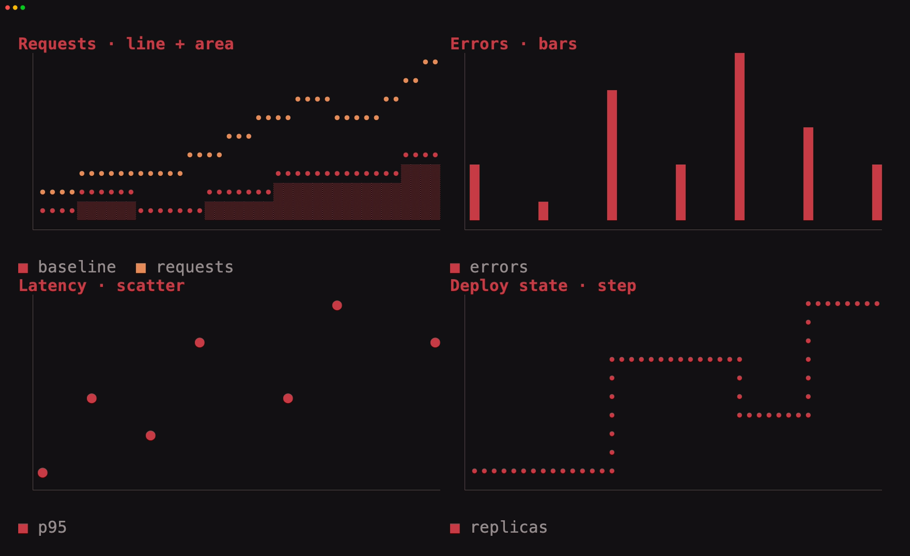

# tuika-charts

Adaptive terminal charts for [tuika](https://github.com/everruns/tuika).


One chart model renders as smooth pixels through Kitty, iTerm2, or Sixel when
available, and as a Unicode cell chart everywhere else. Both paths support the
same deliberately small grammar: numeric x/y data; line, bar, area, scatter,
and step series; fixed or automatic domains; colors; title; and legend.

```rust
use tuika_charts::{Chart, Point, Series};

let chart = Chart::new()
    .title("Requests")
    .series(Series::area("baseline", [
        Point::new(0.0, 10.0),
        Point::new(1.0, 14.0),
        Point::new(2.0, 13.0),
    ]))
    .series(Series::line("api", [
        Point::new(0.0, 12.0),
        Point::new(1.0, 18.0),
        Point::new(2.0, 15.0),
    ]));
```

By default, `Chart` uses the portable cell renderer. For adaptive graphics, pass
the host's detected `ImageSupport` and per-frame `ImageLayer`, then emit and clear
the layer after `terminal.draw()`. This is the same lifecycle as tuika's `Image`.
See the [chart guide](https://github.com/everruns/tuika/blob/main/docs/charts.md) and runnable example:

```bash
cargo run -p tuika-charts --example charts
cargo run -p tuika-charts --example charts -- --dump
```

The data model borrows the useful common denominator from declarative chart
grammars such as TanStack Charts, while intentionally excluding interactions,
HTML layout, custom marks, and renderer-specific options that cannot behave the
same way in both terminal renderers.
