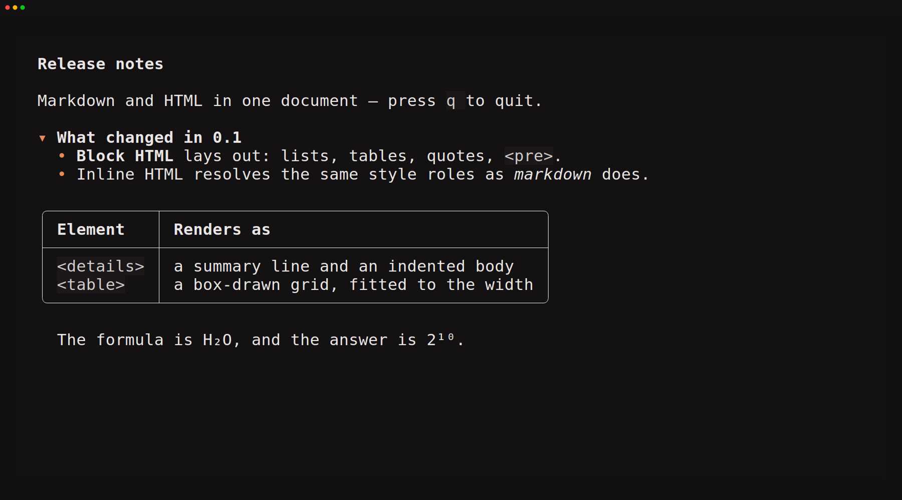

# tuika-html

Terminal-native HTML for [`tuika`](https://crates.io/crates/tuika): raw HTML
blocks inside Markdown, and a standalone `Html` view. Built on
[`html5ever`](https://crates.io/crates/html5ever), so implied end tags,
`<tbody>` insertion, and malformed input are handled the way a browser handles
them — which is exactly the dependency tuika core will not carry, and why this
crate exists separately.

## In Markdown

`HtmlRenderer` implements both of tuika's markdown seams: `HtmlBlockRenderer`
for raw `<details>` / `<table>` / `<div>` blocks, and `FencedBlockRenderer` for
` ```html ` fences.

```rust
use tuika::components::Markdown;
use tuika_html::HtmlRenderer;

let html = HtmlRenderer::new();
let document = Markdown::new("<details><summary>Notes</summary>Body</details>")
    .html_renderer(&html)
    .block_renderer(&html);
# let _ = document;
```

Below, the `<details>`, the `<ul>` inside it, and the `<table>` are all raw HTML
in a markdown document — laid out by the seam, beside markdown the renderer
never sees:



Without a renderer attached, tuika drops block HTML — so adding this crate is
purely additive. The presentational *inline* tags (`<b>`, `<a>`, `<br>`,
`<sub>`, …) render in tuika itself and need nothing from here.

## Standalone

`Html` is a `View`, the HTML counterpart to `Markdown` — place it in a layout
and the whole pane is HTML, fitted to whatever width it is given:

```rust
use tuika_html::Html;

let page = Html::new("<h1>Release notes</h1><ul><li>Faster</li></ul>");
# let _ = page;
```


## What renders

Headings, paragraphs, lists (ordered, unordered, nested), definition lists,
block quotes, `<pre>`, `<hr>`, `<table>`, `<details>`/`<summary>`, and the
presentational inline elements. Unknown elements stay transparent, so their text
still shows; `<script>`, `<style>`, and embedded objects are dropped with their
content.

Every element resolves a tuika `StyleSheet` role rather than a color of its own,
so HTML inherits the host's theme along with everything else on screen.

An `<a href>` is clickable, not merely styled: the renderer reports where each
anchor's label landed — through wrapping, list indents, and table borders alike
— and markdown and the `Html` view both emit OSC 8 for it under the host's
`LinkPolicy`. `to_block` exposes the same pair for a direct caller.

There is **no CSS**, no `style` attribute, no floats, and no positioning. This
renders content, not pages: the goal is that HTML in a transcript reads as well
as the markdown around it, not that a terminal becomes a browser.

One framing detail worth knowing: pulldown-cmark ends an HTML block at a blank
line, so an element whose content is separated by blank lines reaches the
renderer as several independent blocks. Keep an element's markup contiguous and
it lays out as one.

## Untrusted input

HTML in a transcript is untrusted. Control bytes are stripped before any text
becomes a cell, so markup can never emit terminal commands. Input size, output
lines, and nesting depth are bounded by `Limits`; over either the size or the
nesting bound the renderer returns `None` and markdown drops the block. Nothing
is fetched — `` renders as its alt text.

Nesting is measured on the source **before** parsing, and that ordering is
load-bearing: html5ever builds and drops its tree recursively, so deep enough
markup overflows the stack before any of this crate's code runs — a 140 KiB
fragment of nested `<b>` is enough, well inside the size bound. Capping the
traversal cannot help; the input has to be refused first.

## Run the examples

```sh
cargo run -p tuika-html --example html_view       # the `Html` component (q quits)
cargo run -p tuika-html --example html_markdown   # HTML blocks inside markdown
```

Both take `-- --dump` to print one frame as text instead of running.
