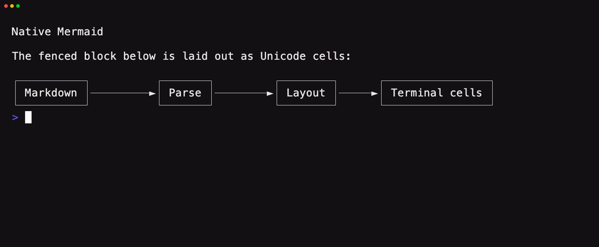

# tuika-mermaid

Terminal-native Mermaid diagrams inside
[`tuika`](https://crates.io/crates/tuika) Markdown. The crate adapts
[`mmdflux`](https://crates.io/crates/mmdflux) to tuika's generic fenced-block
renderer seam; diagrams are Unicode cells, not images, and require no browser or
JavaScript runtime.

```rust
use tuika::components::Markdown;
use tuika_mermaid::MermaidRenderer;

let mermaid = MermaidRenderer::new();
let document = Markdown::new(
    "```mermaid\nflowchart LR\n  Parse --> Layout --> Paint\n```",
)
.block_renderer(&mermaid);

# let _ = document;
```

`MermaidRenderer` handles `mermaid` fences. Unsupported syntax and fences over
64 KiB fall back to tuika's ordinary themed code-block presentation, so
malformed or oversized content remains visible.



Run the integration example:

```sh
cargo run -p tuika-mermaid --example mermaid_markdown
```
