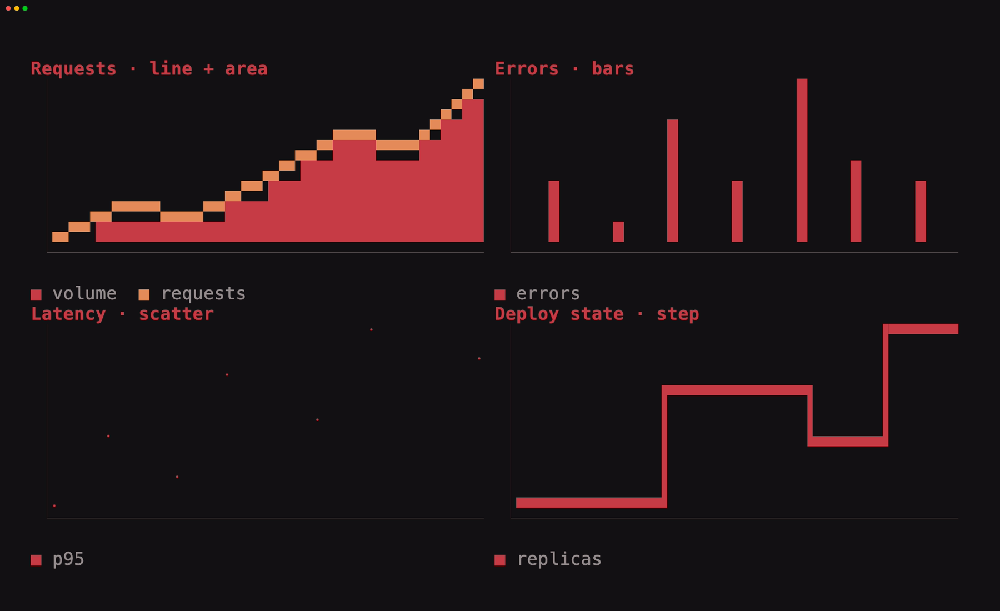

# Charts

[`tuika-charts`](https://crates.io/crates/tuika-charts) is tuika's lightweight
chart companion. It adapts rendering to the terminal without changing the chart
or its data:



The committed screenshot shows the portable renderer; run the same example in
a graphics-capable terminal to see its plot switch to smooth pixels.

- **Kitty, iTerm2, or Sixel:** smooth rasterized lines and filled bars are sent
  through tuika's graphics layer.
- **Every other terminal:** a Ratatui-inspired Unicode plot draws connected
  geometry with dense 2×2 quadrant glyphs, scatter points with Braille subcells,
  area fills to the same subcell boundary, and axes, bars, and the legend
  directly into cells.

The renderer is the adaptive implementation detail. Titles, series, domains,
colors, clipping, and legends have the same meaning in both paths.

## Grammar

The first release intentionally supports only the common portable subset:

- numeric `(x, y)` points;
- line and vertical bar series;
- filled area series;
- independent scatter points;
- horizontal-then-vertical step series;
- multiple named series;
- automatic or explicit x/y domains;
- per-series colors;
- an optional title and legend.

Automatic x domains reserve half a bar interval beyond the outermost bar, so a
centered first or last bar remains inside the plot. Explicit domains are used
verbatim and therefore control clipping directly.

Interactions, tooltips, HTML/SVG marks, smoothed curves, stacked data,
categorical axes, and renderer-specific configuration are outside the shared
grammar. Keeping the
model smaller than either renderer prevents charts from silently losing meaning
when graphics support changes.

```rust
use tuika_charts::{Chart, Domain, Point, Series};

let chart = Chart::new()
    .title("API traffic")
    .x_domain(Domain::new(0.0, 6.0).unwrap())
    .series(Series::line("requests", [
        Point::new(0.0, 12.0),
        Point::new(1.0, 18.0),
        Point::new(2.0, 16.0),
    ]))
    .series(Series::area("baseline", [
        Point::new(0.0, 9.0),
        Point::new(1.0, 12.0),
        Point::new(2.0, 11.0),
    ]))
    .series(Series::scatter("errors", [
        Point::new(0.0, 2.0),
        Point::new(1.0, 1.0),
        Point::new(2.0, 4.0),
    ]));
```

`Chart` is a normal `View`. `Runner` detects graphics support and supplies the
per-frame image layer automatically. Direct calls to `paint` remain portable
cell rendering by default, which keeps tests deterministic.

## Run adaptively

Run the chart like any other application view; no graphics setup is required:

```rust,ignore
let chart = Chart::new()
    .series(Series::line("requests", points));

// Return `chart` from your Application::view implementation.
Runner::new(RunnerConfig::default())
    .run_app(&Theme::default(), &mut app)?;
```

Custom hosts can install an `ImageSupport` and `ImageLayer` with
`RenderCtx::with_image_graphics`, then emit and clear the layer after their cell
frame. Non-finite points are ignored; a chart with no finite points renders `No
chart data` rather than panicking.

Run the example with `q`/`Esc` to quit:

```bash
cargo run -p tuika-charts --example charts
```
