# tuika component gallery

A visual catalog of tuika's components — each with a name, a one-line
description, and an animated demo.

## Motion

Animated from a host-supplied frame counter (see the [`anim`](https://docs.rs/tuika/latest/tuika/anim/index.html) module).

### `Spinner`

A frame-cycled activity glyph — `Braille` (smooth default), `Line` (ASCII
fallback), or `Dots`. [API](https://docs.rs/tuika/latest/tuika/components/struct.Spinner.html)

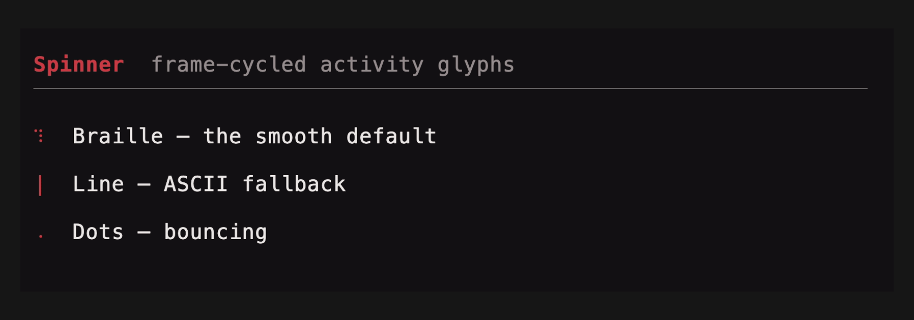

```rust
use tuika::prelude::*;
view! {
    row(gap = 1) {
        node(Spinner::new(frame).style(SpinnerStyle::Braille))
        text("working…")
    }
}
```

### `ProgressBar`

A single-row bar: determinate (sub-cell eighth-block fill, optional `NN%`) or an
indeterminate marquee driven by the frame counter.
[API](https://docs.rs/tuika/latest/tuika/components/struct.ProgressBar.html)

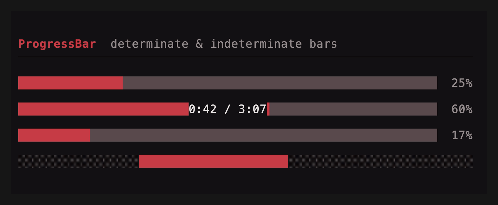

```rust
use tuika::prelude::*;
view! {
    col(gap = 1) {
        node(ProgressBar::determinate(0.6).percent(true))
        node(ProgressBar::indeterminate(frame))
    }
}
```

### `Loader`

A spinner, a message, and an optional trailing hint on one row.
[API](https://docs.rs/tuika/latest/tuika/components/struct.Loader.html)

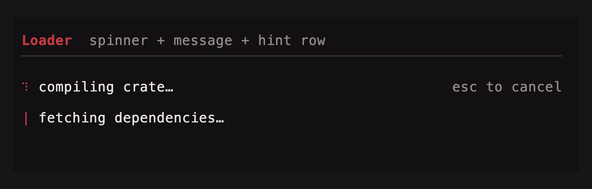

```rust
use tuika::prelude::*;
view! {
    node(Loader::new(frame, "compiling crate…").hint("esc to cancel"))
}
```

### `Timeline`

A scheduler-free keyframe track: values eased over frame offsets, with
`Once`/`Loop`/`PingPong` repeat, sampled purely from the host frame counter — the
minimal analog of OpenTUI's Timeline. Compose several (one per animated property)
rather than reconciling a tween tree. The demo drives three `ProgressBar`s from
three timelines.
[API](https://docs.rs/tuika/latest/tuika/anim/struct.Timeline.html)

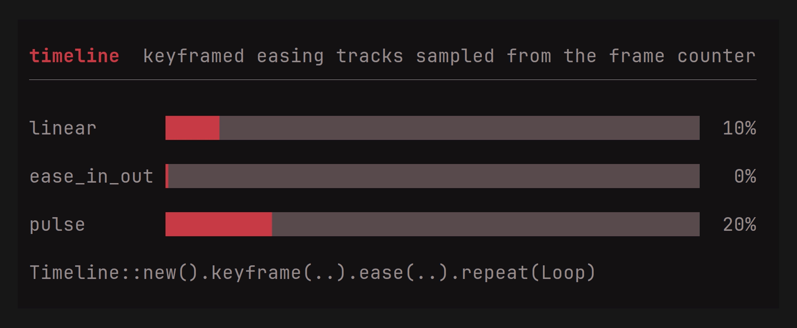

```rust
use tuika::anim::ease_out;
use tuika::prelude::*;
let slide = Timeline::new().keyframe(0, 0.0).ease(30, 1.0, ease_out);
let pulse = Timeline::new()
    .keyframe(0, 0.0).keyframe(10, 1.0).keyframe(20, 0.0)
    .repeat(Repeat::Loop);
let x = slide.sample(frame); // 0.0 → 1.0 over 30 frames, then holds
```

## Text

### `Text`

A block of pre-styled [`Line`](https://docs.rs/ratatui)s drawn top-down and
clipped. `Paragraph` word-wraps plain text in one style; `Wrap` word-wraps
pre-styled lines while preserving per-span styles.
[API](https://docs.rs/tuika/latest/tuika/components/text/struct.Text.html)

Horizontal alignment is honored. `Text` and `Wrap` read each `Line`'s
`alignment` (unset = flush-left), so centered titles, right-aligned totals, and
centered empty-state messages built by an existing formatting layer render as
intended; `Wrap` carries a line's alignment onto every reflowed row.
`Paragraph` takes one alignment for the whole block via `.alignment(..)`.

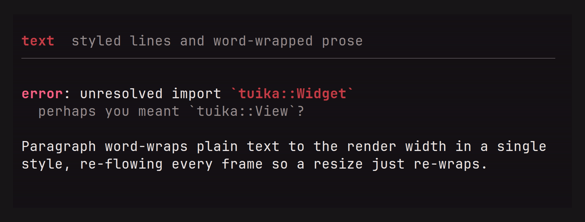

```rust
use ratatui::layout::Alignment;
use ratatui::text::Line;
use tuika::prelude::*;
view! {
    col(gap = 1) {
        // Per-line alignment on pre-styled lines.
        node(Text::new(vec![
            Line::from("flush left"),
            Line::from("centered").centered(),
            Line::from("flush right").right_aligned(),
        ]))
        // One alignment for a wrapped plain-text block.
        node(Paragraph::new("word-wrapped prose", style).alignment(Alignment::Center))
    }
}
```

### `Rule`

A one-row horizontal separator: optional leading title, then a fill glyph out to
the width. [API](https://docs.rs/tuika/latest/tuika/components/struct.Rule.html)

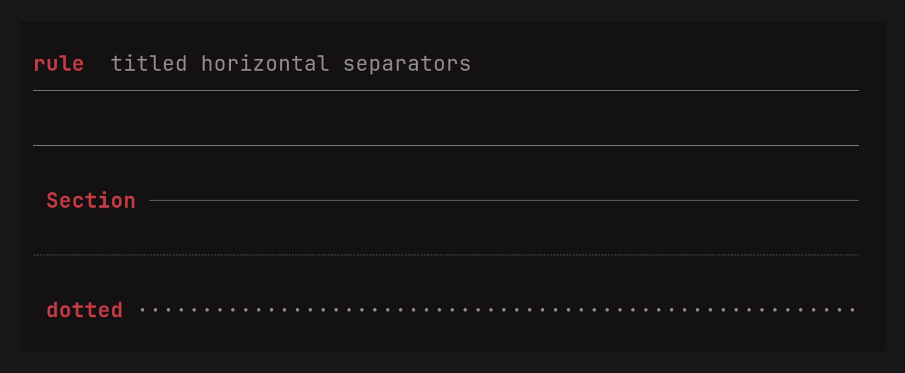

```rust
use tuika::prelude::*;
view! {
    node(Rule::new().title(" Section "))
}
```

## Markdown & code

### `Markdown` + `MarkdownState`

Renders CommonMark (plus GFM tables and strikethrough) to styled lines —
word-wrapping prose and re-laying-out code and tables to the render width.
`MarkdownState` is the streaming form: fed deltas as a message arrives, it
re-parses only the in-flight tail and caches everything before the last stable
block boundary, so long transcripts don't re-tokenize. The cache holds
width-independent parsed blocks, so layout (including table column fitting) is
recomputed each frame — pass the current width and the output tracks the view
as it resizes.
[API](https://docs.rs/tuika/latest/tuika/components/markdown/struct.Markdown.html)

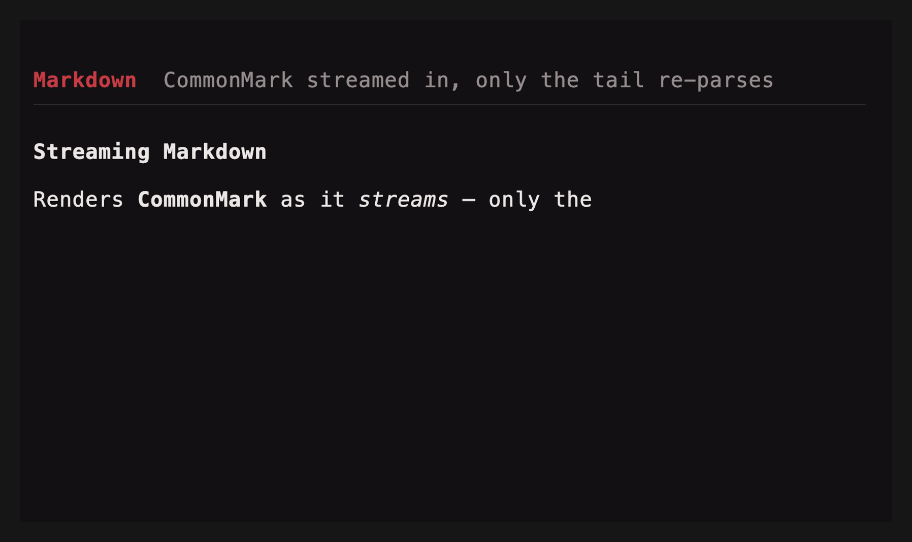

```rust
use tuika::prelude::*;
let theme = Theme::default();
let mut md = MarkdownState::new();
md.push_str(delta);                                  // forward each stream delta
let sheet = StyleSheet::from_theme(&theme);
let lines = md.lines(width, &theme, &sheet, CodeHighlighter::Plain);
view! { node(tuika::components::Text::new(lines)) }
```

#### Extensible fenced blocks

`FencedBlockRenderer` can replace a language fence with terminal-native,
width-aware lines. A renderer returns `None` for languages or inputs it does not
handle, preserving the normal themed code block. `tuika-mermaid` supplies an
mmdflux-backed implementation:

```rust
use tuika::prelude::*;
use tuika_mermaid::MermaidRenderer;

let mermaid = MermaidRenderer::new();
let doc = Markdown::new(
    "```mermaid\nflowchart LR\n  Source --> Parse --> Paint\n```",
)
.block_renderer(&mermaid);
# let _ = doc;
```

The fence is painted directly as Unicode cells:


#### GFM tables

Pipe tables render with box-drawing borders, a bold header, and per-column
alignment from the `:---:` markers. Columns size to their content, then shrink
the widest column (wrapping its cells) to fit the available width; when even
that won't fit — below `4 * cols + 1` columns — the box is dropped for
` | `-joined rows that word-wrap. Because layout is width-driven, the same
source reflows as the view resizes.

```rust
use tuika::prelude::*;
let doc = Markdown::new("\
| Component | Kind        | Resizes |
| :-------- | :---------: | ------: |
| Markdown  | streaming   |     yes |
| CodeBlock | static      |     yes |
");
// Wide area: full boxed grid.        Narrow area: same source, boxless fallback.
// ╭───────────┬───────────┬─────────╮   Component | Kind | Resizes
// │ Component │    Kind   │ Resizes │   Markdown | streaming | yes
// │ Markdown  │ streaming │     yes │   CodeBlock | static | yes
// ╰───────────┴───────────┴─────────╯
# let _ = doc;
```

### `CodeBlock`

A themed, syntax-highlighted fenced block: a language label, a left rail, and a
code background. Highlighting comes from a pluggable `Highlighter` (none → plain,
theme-colored text); the `tuika-codeformatters` crate ships a tree-sitter one. An
optional line-number gutter (`line_numbers(true)` / `start_line(n)`) rides to the
left of the rail.
[API](https://docs.rs/tuika/latest/tuika/components/struct.CodeBlock.html)

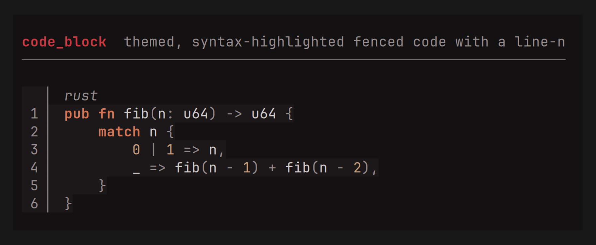

```rust
use tuika::prelude::*;
view! {
    node(CodeBlock::new("rust", "fn main() {}").highlighter(&highlighter).line_numbers(true))
}
```

### `Diff`

A line-oriented diff (LCS) rendered **unified** (`+`/`-`/` ` gutters) or
**side-by-side**, with an optional line-number gutter. Added/removed lines use
conventional green/red (overridable via `DiffStyle`). The pure `diff::rows(old,
new)` classifier is reusable on its own.
[API](https://docs.rs/tuika/latest/tuika/components/diff/struct.Diff.html)

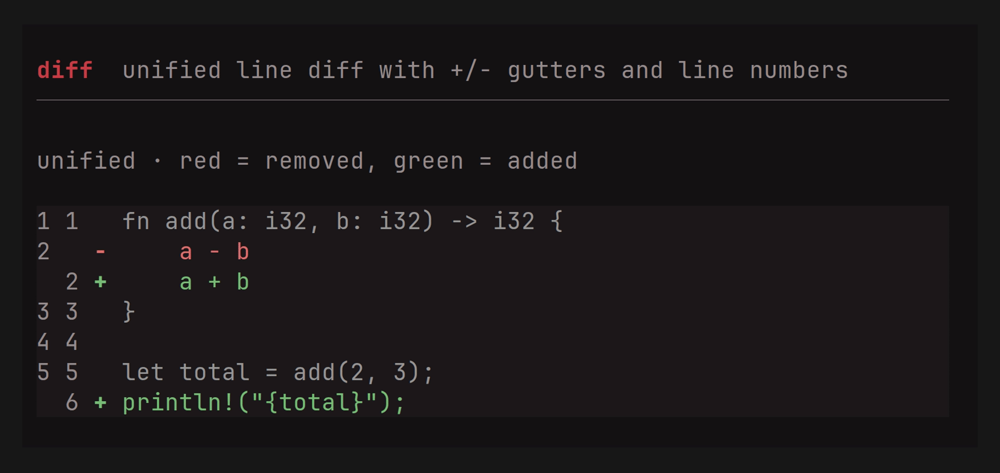

```rust
use tuika::prelude::*;
view! {
    node(Diff::new(old, new).mode(DiffMode::SideBySide).line_numbers(true))
}
```

## Layout

### `Flex`

The flexbox container and composition primitive — `grow(n)` children share
leftover space by weight, `fixed(n)` reserve exact size, with `gap` and
`padding`. It *is* the `view!` DSL's `row`/`col`.
[API](https://docs.rs/tuika/latest/tuika/components/struct.Flex.html)

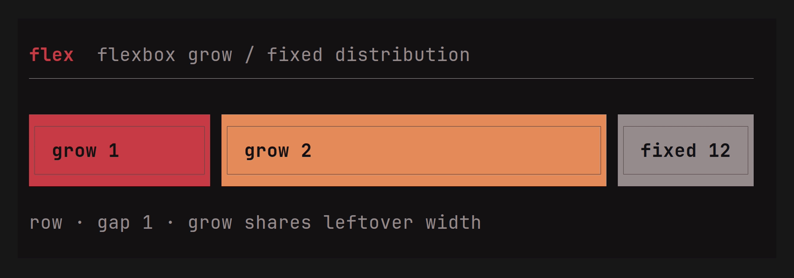

```rust
use tuika::prelude::*;
view! {
    row(gap = 1) {
        grow(1) { node(left) }
        fixed(12) { node(right) }
    }
}
```

Need the child rects *before* (or without) painting — to size a scroll region
to a pane's real height, hit-test a click, or decide what fits? `Flex::solve`
runs the same measure-then-solve pass render uses and returns one `Rect` per
child, painting nothing. The underlying flexbox solver is also callable directly
as `tuika::layout::solve(area, &style, &items)` for layouts built without a `Flex`.

```rust
use tuika::prelude::*;
use ratatui::layout::Rect;

let flex = Flex::row()
    .fixed(8, element(Text::raw("sidebar")))
    .grow(1, element(Text::raw("content")));
let rects = flex.solve(Rect::new(0, 0, 40, 10)); // [sidebar_rect, content_rect]
```

### `Boxed`

A border + padding + title wrapping one child. The border color is focus-aware
by default (theme `border` / `border_focused`); `border_color(Color)` overrides
that with an explicit color for semantic frames — an accent or danger modal, or
a per-pane color a host resolves itself. An optional `title_bottom` rides the
bottom border — the slot for a `1 of 3` position counter, a footer legend, or a
hint. Both titles honor their `Line` alignment; unset, the top title is
flush-left and the bottom title flush-right.
[API](https://docs.rs/tuika/latest/tuika/components/struct.Boxed.html)

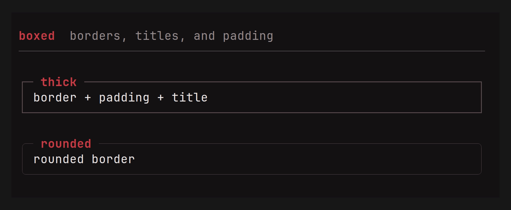

```rust
use tuika::prelude::*;
view! {
    boxed(title = " title ", title_bottom = " 1/3 ", border = BorderStyle::Rounded) {
        node(child)
    }
}
```

### `FocusScope`

A layout-transparent wrapper that renders its subtree with an explicit focus
flag. Focus lives on the render context and `paint` uses one root context, so a
`Flex` can't hand a single child `focused = true`; wrap each pane in a
`FocusScope` so the active one's `Boxed` border lights up while the others stay
dim — independently of the frame's root focus.
[API](https://docs.rs/tuika/latest/tuika/components/struct.FocusScope.html)

```rust
use tuika::prelude::*;
view! {
    row(gap = 1) {
        grow(1) { node(FocusScope::focused(element(Boxed::new(element(Text::raw("active")))))) }
        grow(1) { node(FocusScope::unfocused(element(Boxed::new(element(Text::raw("idle")))))) }
    }
}
```

### `StatusBar`

One row with left- and right-anchored segment groups.
[API](https://docs.rs/tuika/latest/tuika/components/struct.StatusBar.html)

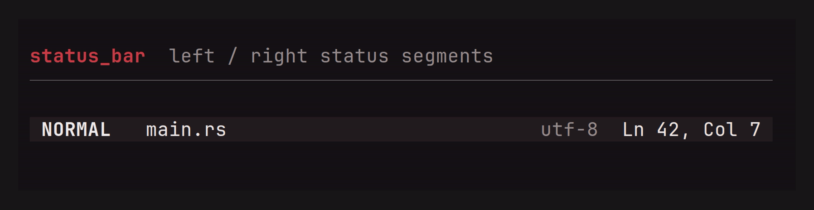

```rust
use tuika::prelude::*;
view! {
    node(StatusBar::new().left(left_spans).right(right_spans))
}
```

## Interactive

Each pairs a rendered view with a host-persisted `*State` (the
`StatefulWidget` idiom): the state owns cursor/offset/selection and handles
events, the view borrows it for a frame.

### `Scroll` + `ScrollState`

A windowed view over long content with a scrollbar; `ScrollState` handles
paging, wheel scroll, and stick-to-bottom. The offset is also **host-drivable**:
`set_offset(n)` mirrors an app-owned scroll position into the view — the
vertical peer of `SelectState::select` — for event-loop apps that track their
own position. Content wider than the pane (logs, diffs, wide tables, deep paths)
**pans horizontally** with `set_x_offset(cols)` (bind to `h`/`l` or `←`/`→`),
bounded by `clamp_x` — the pan is width-aware, so wide/CJK glyphs never split.
`ScrollState::max_offset` / `max_x_offset` expose the in-range bounds for a host
driving the offsets itself.
[API](https://docs.rs/tuika/latest/tuika/components/struct.Scroll.html)


```rust
use tuika::prelude::*;
let mut state = ScrollState::new();          // held by the host across frames
state.handle(&event, content_h, viewport_h); // built-in wheel/paging, or…
state.set_offset(app.scroll_row);            // …mirror an app-owned row, and
state.set_x_offset(app.scroll_col);          // …pan wide lines left/right
state.clamp_x(widest_line_w, viewport_w);    // keep the pan within the content
view! { node(Scroll::new(lines, &state)) }
```

#### Following a stream

Content that grows while it is being read — a transcript, a log tail, a
streaming answer — wants to show the newest rows *until the reader scrolls away
from them*. That is not a mode to implement; it falls out of two calls:

```rust
use tuika::prelude::*;
let mut state = ScrollState::new();

// Once per frame, after appending: pins the offset to the newest content while
// the state is stuck to the bottom, and leaves a scrolled-back reader alone.
state.clamp(content_h, viewport_h);

// Scrolling up releases the stick; reaching the bottom again re-arms it.
state.handle(&event, content_h, viewport_h);

// Read it back to tell the reader which they are.
let live = state.is_stuck_to_bottom();
```

`examples/markdown.rs` runs exactly this over a streaming `MarkdownState`.

### `ItemScroll`

The same viewport over **items** instead of lines: `Vec<Element>`, each measured
at the render width and stacked with an optional `gap`. Scrolling is by row, not
by item, so an entry taller than the space left clips at the viewport edge and
scrolls through it — which is what a chat transcript, a feed, or any history of
laid-out things needs. Reach for `Scroll` when the content really is lines
(logs, prose); reach for this when an entry is a panel, a table, a diff, or a
nested layout. `measure_height` reports the row count so the host can reconcile
its `ScrollState` before painting, and `windowed` takes just the visible slice
plus the true height for lists too long to measure every frame.
[API](https://docs.rs/tuika/latest/tuika/components/struct.ItemScroll.html)


```rust
use tuika::prelude::*;
let items: Vec<Element> = history.iter().map(|entry| entry.view()).collect();
let content_h = ItemScroll::measure_height(&items, width, 1, true);
state.clamp(content_h, viewport_h);          // reconcile before the paint
view! { node(ItemScroll::new(items, &state).gap(1)) }
```

### `Viewport` + `ScrollState`

A two-dimensional clipped window over any child `Element`, rather than only
line content. The host supplies the child's full cell extent and persists
vertical/horizontal offsets in `ScrollState`; optional right and bottom
scrollbars track the clamped window. Wide grapheme clusters are never painted
halfway across either clipped edge.
[API](https://docs.rs/tuika/latest/tuika/components/struct.Viewport.html)

```rust
use tuika::prelude::*;
let view = Viewport::new(element(markdown_or_grid), Size::new(120, 80), &scroll)
    .horizontal_scrollbar(true);
```

### `Form` + `FormField` + `FormState`

Responsive labeled controls with help and validation rows. Labels share a
column on wide terminals and stack above controls on narrow terminals.
`FormState` handles focus traversal and submit/cancel outcomes; control values
remain in their normal host-owned state.
[API](https://docs.rs/tuika/latest/tuika/components/struct.Form.html)

```rust
use tuika::prelude::*;
let form = Form::new(vec![
    FormField::new("Name", element(name_input)).help("Shown publicly"),
    FormField::new("Mode", element(mode_select)).error(validation_error),
], &form_state);
```

### `Scene` + `Dialog`

`Scene` owns a base tree and ordered, anchored overlays. `Dialog` builds a
centered modal from ordinary Tuika elements, with optional action hints,
min/max sizing, clear or dimmed backdrops, and top-layer focus ownership.
[Scene API](https://docs.rs/tuika/latest/tuika/scene/struct.Scene.html) ·
[Dialog API](https://docs.rs/tuika/latest/tuika/components/struct.Dialog.html)


```rust
use tuika::prelude::*;
let scene = Scene::new(element(base)).dialog(
    Dialog::new("Confirm", element(Text::raw("Continue?")))
        .key_hints([("enter", "yes"), ("esc", "no")])
        .dim_backdrop(true)
        .focus_owner("confirm"),
);
```

### `DrawView` / `CanvasView`

A closure-backed escape hatch for custom cell drawing. Its callback receives
the assigned area, clipped `Surface`, and `RenderCtx`, and composes as a normal
view.
[API](https://docs.rs/tuika/latest/tuika/view/struct.DrawView.html)

```rust
use ratatui::layout::Rect;
use tuika::{RenderCtx, Surface};
use tuika::view::DrawView;
let chart = DrawView::new(
    |area: Rect, surface: &mut Surface<'_>, ctx: &RenderCtx<'_>| {
        surface.set_string(area.x, area.y, "▁▃▆█", ctx.theme.success_style());
    },
);
```

### `SelectList` + `SelectState`

A selectable list; `SelectState` navigates with the arrow keys (wrapping),
confirms on Enter, cancels on Esc.
[API](https://docs.rs/tuika/latest/tuika/components/struct.SelectList.html)


```rust
use tuika::prelude::*;
let mut state = SelectState::new();
state.handle(&event, items.len());
view! { node(SelectList::new(items, &state)) }
```

### `Table` + `SelectState`

The multi-column peer of `SelectList` — the widget behind repo/branch/worktree
browsers, process and container lists, and file explorers: a header row,
per-column width policy, a full-row selection highlight, a caret gutter, and
windowed scrolling. Column widths come from the same flexbox `solve` as every
other container — a `Column` is `fixed`, `auto` (widest cell), or `flex`
(shares leftover width). Selection reuses `SelectState`, so a list and a table
share one state type. Chrome follows the theme by default but is overridable
(the `Boxed::border_color` pattern): `.caret(char)` sets the gutter marker,
`.header_style(Style)` restyles the header, and `.preserve_selection_fg(true)`
keeps color-coded columns' own colors under the selection highlight.
[API](https://docs.rs/tuika/latest/tuika/components/struct.Table.html)

```rust
use ratatui::text::Line;
use tuika::prelude::*;
let mut state = SelectState::new();
state.handle(&event, rows.len());
let columns = vec![Column::auto("branch"), Column::fixed("ahead", 5), Column::flex("subject", 1)];
view! { node(Table::new(columns, rows, &state).viewport(20).caret('▶')) }
```

### `Tabs` + `TabsState`

A one-line tab strip; `TabsState` handles left/right and tab navigation.
[API](https://docs.rs/tuika/latest/tuika/components/struct.Tabs.html)


```rust
use tuika::prelude::*;
let mut state = TabsState::default();
state.handle(&event, labels.len());
view! { node(Tabs::new(labels, &state)) }
```

### `TabSelect` + `TabSelectState`

A value-selecting segmented control (as opposed to `Tabs`, which is navigation
chrome): moving the cursor changes the selected value immediately, and
Enter/Space activates it. `handle` returns a `TabSelectOutcome` distinguishing a
change from an activation.
[API](https://docs.rs/tuika/latest/tuika/components/struct.TabSelect.html)


```rust
use tuika::prelude::*;
let mut state = TabSelectState::default();
state.handle(&event, labels.len());
view! { node(TabSelect::new(labels, &state)) }
```

### `Slider` + `SliderState`

A one-row value picker over a numeric range with a filled track and thumb.
`SliderState` clamps to `min..=max`, steps via the arrow keys (Home/End snap to
the bounds), and `set_ratio` maps a click position to a value.
[API](https://docs.rs/tuika/latest/tuika/components/struct.Slider.html)


```rust
use tuika::{Slider, SliderState, view};
let mut state = SliderState::new(0.0, 100.0, 40.0).step(5.0);
state.handle(&event);
view! { node(Slider::new(&state).label(&state)) }
```

### `TextInput` + `TextInputState`

A multi-line edit model: buffer, cursor, editing, and soft-wrap. `TextInput`
renders a snapshot; the host places the terminal cursor from
`TextInputState::cursor_screen`. Configure Enter vs Shift+Enter with
`TextInputMode` (`SubmitOnEnter` by default): the other chord inserts a newline.
Ctrl+J always inserts a newline (raw-mode LF from terminals without enhanced
keyboard reporting). `placeholder` fills an empty buffer, and `highlights` paints
host-computed `TextSpan` ranges over the text.
[API](https://docs.rs/tuika/latest/tuika/components/struct.TextInput.html)


```rust
use tuika::{TextInput, TextInputMode, TextInputState, view};
let mut state = TextInputState::from_text("");
state.set_mode(TextInputMode::SubmitOnEnter);
view! {
    boxed(title = " commit message ") {
        node(TextInput::new(&state))
    }
}
```

#### Inline tokens: `@mentions`, `/commands`, anything

A composer usually wants more than plain text: a `@` that completes a file, a
`/` that opens a command palette, a `#` that links an issue. `Trigger` declares
*where* an opening character counts (`TriggerAnchor::{Anywhere, WordStart,
LineStart, BufferStart}`) and whether the token stops at whitespace; the state
finds them. What they **mean** — which popup opens, what completes, how they are
colored — stays in the host, so any app can define its own set.

```rust
use tuika::{TextInput, TextInputState, Trigger, TriggerAnchor};

let triggers = [
    Trigger::new('/').anchor(TriggerAnchor::BufferStart), // a command palette
    Trigger::new('@'),                                    // a file mention
];

if let Some(token) = state.active_token(&triggers) {      // cursor inside one?
    let rows = complete(token.trigger, token.query());    // host's own source
    // …and on confirm, splice the choice back in:
    state.replace_token(&token, "@src/lib.rs ");
}

// Color every token, whether or not the cursor is in it.
let spans = state.tokens(&triggers).iter().map(|t| t.span(mention_style)).collect();
view! { node(TextInput::new(&state).highlights(spans)) }
```

## Notifications & console

### `Toasts` + `ToastList`

A transient notification stack with frame-driven expiry: each toast carries a
remaining lifetime in frames, `tick()` decrements them, and one is dropped at
zero. Four severity levels select the bar color and glyph. Place a `ToastList`
in a corner overlay.
[API](https://docs.rs/tuika/latest/tuika/components/toast/struct.Toasts.html)

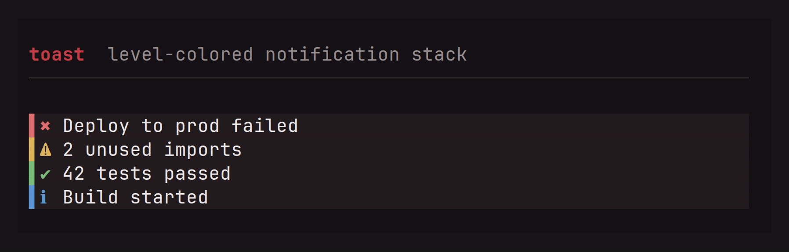

```rust
use tuika::{ToastLevel, ToastList, Toasts, view};
let mut toasts = Toasts::new(4);
toasts.push(ToastLevel::Success, "Saved");
toasts.tick(); // once per frame; drops expired toasts
view! { node(ToastList::new(&toasts)) }
```

### `Console` + `ConsoleLog`

Capture `println!`/`tracing` output into a capped ring buffer and show it in a
toggleable overlay. `ConsoleLog` is a cheap, cloneable, `Send`/`Sync` handle that
implements `std::io::Write`, so it drops straight into a logging pipeline; the
`Console` view tails the most recent lines.
[API](https://docs.rs/tuika/latest/tuika/components/console/struct.ConsoleLog.html)

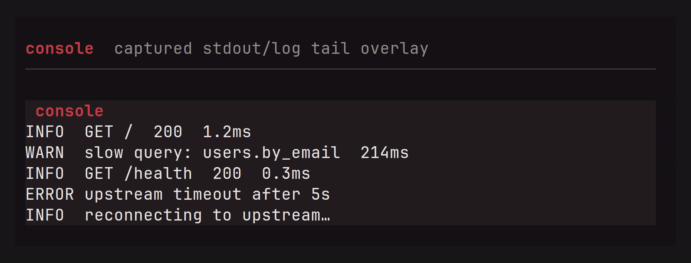

```rust
use tuika::{Console, ConsoleLog, view};
let log = ConsoleLog::new(500);
// tracing_subscriber::fmt().with_writer({ let l = log.clone(); move || l.clone() }).init();
view! { node(Console::new(&log).title(" console ")) }
```

## Banners, codes & pixels

### `AsciiFont`

Large "figlet-style" block-letter banners from an embedded 5-row font (A–Z, 0–9,
punctuation; case-insensitive). Themed accent by default, overridable.
[API](https://docs.rs/tuika/latest/tuika/components/ascii_font/struct.AsciiFont.html)

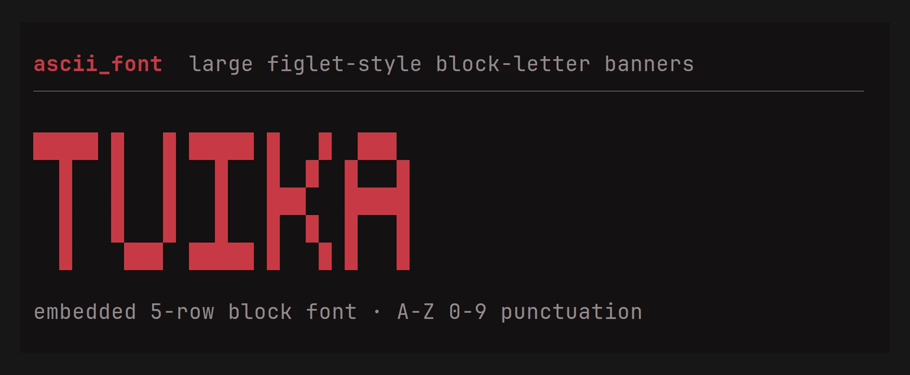

```rust
use tuika::{AsciiFont, view};
view! { node(AsciiFont::new("TUIKA")) }
```

### `QrCode`

A QR code drawn with half-block cells. The bundled encoder is byte-mode, versions
1–4 (up to 78 bytes at ECC Low — URLs, Wi-Fi credentials, tokens), with
Reed-Solomon, interleaving, and masking; larger payloads can be encoded elsewhere
and handed to `QrCode::from_matrix`.
[API](https://docs.rs/tuika/latest/tuika/components/qr/struct.QrCode.html)

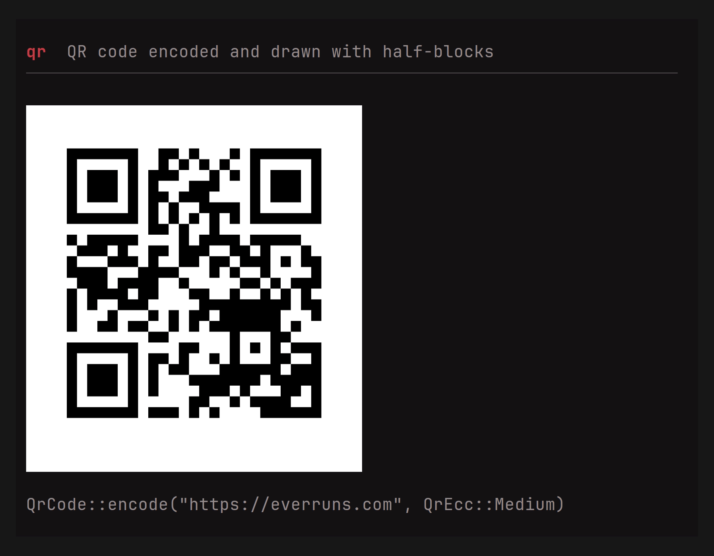

```rust
use tuika::{QrCode, QrEcc, view};
let qr = QrCode::encode("https://everruns.com", QrEcc::Medium).expect("fits v1–4");
view! { node(qr) }
```

### `FrameBuffer` + `FrameBufferView`

A mutable RGBA pixel canvas — `set`/`blend`/`fill_rect`/`blit`, a per-pixel
`shade` shader post-pass, and `Sprite` spritesheet frames. `FrameBufferView`
packs two vertical pixels per cell with a half-block, so it renders in any
terminal; `to_image_data()` hands the same pixels to the Kitty/iTerm2/Sixel
graphics protocols for a crisp render.
[API](https://docs.rs/tuika/latest/tuika/framebuffer/struct.FrameBuffer.html)

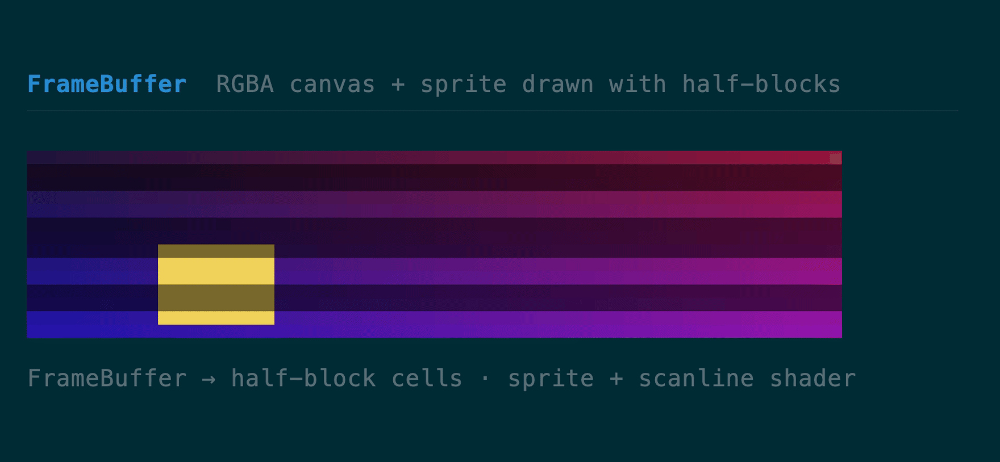

```rust
use tuika::{FrameBuffer, FrameBufferView, view};
let mut fb = FrameBuffer::new(64, 32);
fb.clear([20, 20, 40, 255]);
fb.fill_rect(8, 8, 16, 16, [240, 90, 90, 255]);
view! { node(FrameBufferView::new(&fb, 64, 16)) }
```

## See also

- [API documentation](https://docs.rs/tuika) — the complete component reference,
  including helpers without a standalone demo (`Spacer`, `Responsive`,
  `Constrained`, `Wrap`, `KeyHints`).
- [Runnable examples](../examples/) — enter the alternate screen; quit with `q`/`esc`.
- [README](../README.md) — the model behind the toolkit.
