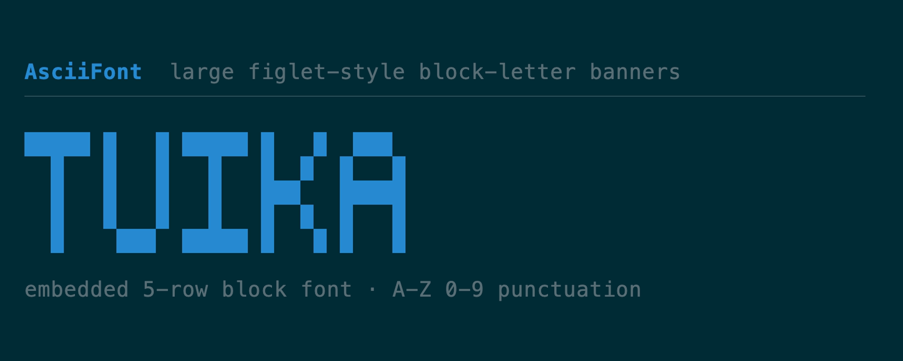
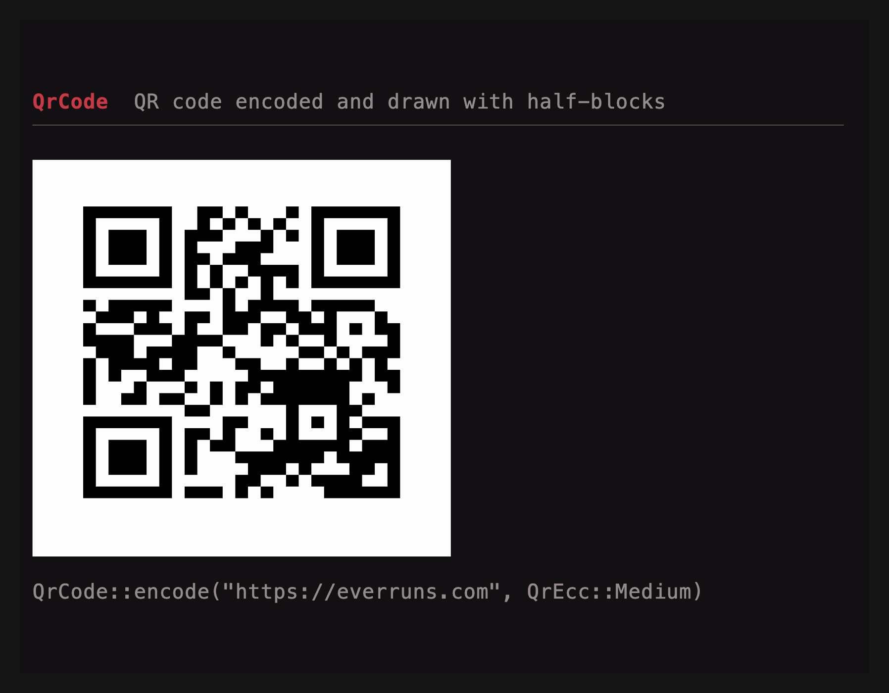
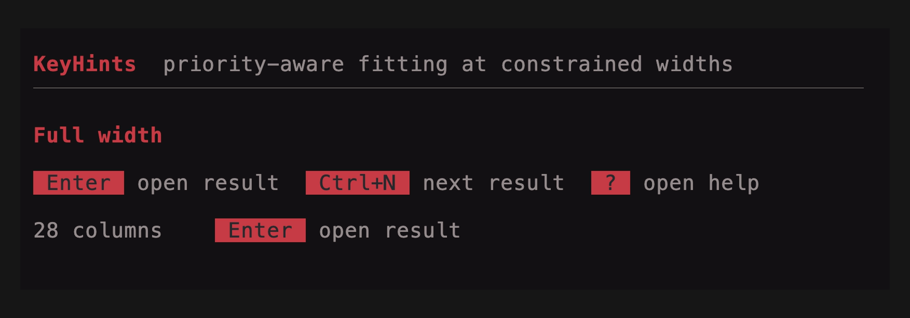
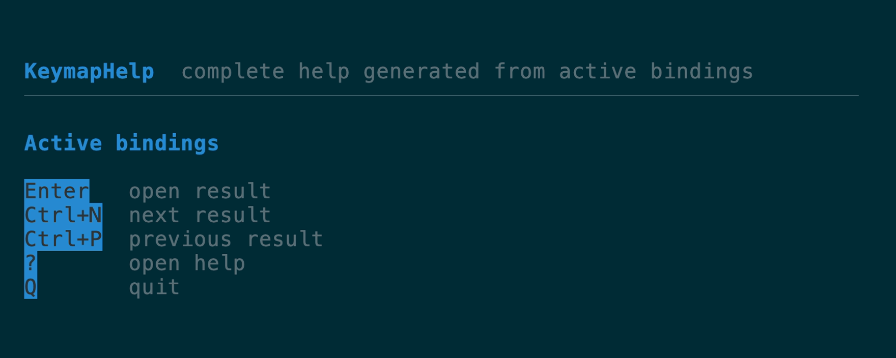

# Banners, codes & pixels components

[All components](../components.md)

### `AsciiFont`

Large "figlet-style" block-letter banners from an embedded 5-row font (A–Z, 0–9,
punctuation; case-insensitive). Themed accent by default, overridable.
[API](https://docs.rs/tuika/latest/tuika/components/ascii_font/struct.AsciiFont.html)



```rust
use tuika::{AsciiFont, view};
view! { node(AsciiFont::new("TUIKA")) }
```

### `QrCode`

A QR code drawn with half-block cells. The bundled encoder is byte-mode, versions
1–4 (up to 78 bytes at ECC Low — URLs, Wi-Fi credentials, tokens), with
Reed-Solomon, interleaving, and masking; larger payloads can be encoded elsewhere
and handed to `QrCode::from_matrix`.
[API](https://docs.rs/tuika/latest/tuika/components/qr/struct.QrCode.html)



```rust
use tuika::{QrCode, QrEcc, view};
let qr = QrCode::encode("https://everruns.com", QrEcc::Medium).expect("fits v1–4");
view! { node(qr) }
```

### `FrameBuffer` + `FrameBufferView`

A mutable RGBA pixel canvas — `set`/`blend`/`fill_rect`/`blit`, a per-pixel
`shade` shader post-pass, and `Sprite` spritesheet frames. `FrameBufferView`
packs two vertical pixels per cell with a half-block, so it renders in any
terminal; `to_image_data()` hands the same pixels to the Kitty/iTerm2/Sixel
graphics protocols for a crisp render.
[API](https://docs.rs/tuika/latest/tuika/framebuffer/struct.FrameBuffer.html)


```rust
use tuika::{FrameBuffer, FrameBufferView, view};
let mut fb = FrameBuffer::new(64, 32);
fb.clear([20, 20, 40, 255]);
fb.fill_rect(8, 8, 16, 16, [240, 90, 90, 255]);
view! { node(FrameBufferView::new(&fb, 64, 16)) }
```

### `KeyHints`

Priority-aware footer hints fit only complete key/action pairs. Contextual
bindings with higher keymap layer priority survive first as width contracts.



[API](https://docs.rs/tuika/latest/tuika/components/struct.KeyHints.html) · [Source](https://github.com/everruns/tuika/blob/main/src/components/key_hints.rs)

### `KeymapHelp`

A complete, vertically scrollable help view generated from the same active,
labeled keymap declarations used for dispatch and footer hints.



[API](https://docs.rs/tuika/latest/tuika/components/struct.KeymapHelp.html) · [Source](https://github.com/everruns/tuika/blob/main/src/components/key_hints.rs)

---

[All components](../components.md)
