# Interactive components

[All components](../components.md)

Each pairs a rendered view with a host-persisted `*State` (the
`StatefulWidget` idiom): the state owns cursor/offset/selection and handles
events, the view borrows it for a frame.

### `Scroll` + `ScrollState`

A windowed view over long content with a scrollbar; `ScrollState` handles
paging, wheel scroll, and stick-to-bottom. The offset is also **host-drivable**:
`set_offset(n)` mirrors an app-owned scroll position into the view — the
vertical peer of `SelectState::select` — for event-loop apps that track their
own position. Content wider than the pane (logs, diffs, wide tables, deep paths)
**pans horizontally** with `set_x_offset(cols)` (bind to `h`/`l` or `←`/`→`),
bounded by `clamp_x` — the pan is width-aware, so wide/CJK glyphs never split.
`ScrollState::max_offset` / `max_x_offset` expose the in-range bounds for a host
driving the offsets itself. For prose, `.wrap(true)` reflows styled lines at the
assigned width before windowing; horizontal panning is disabled in that mode.
[API](https://docs.rs/tuika/latest/tuika/components/struct.Scroll.html)

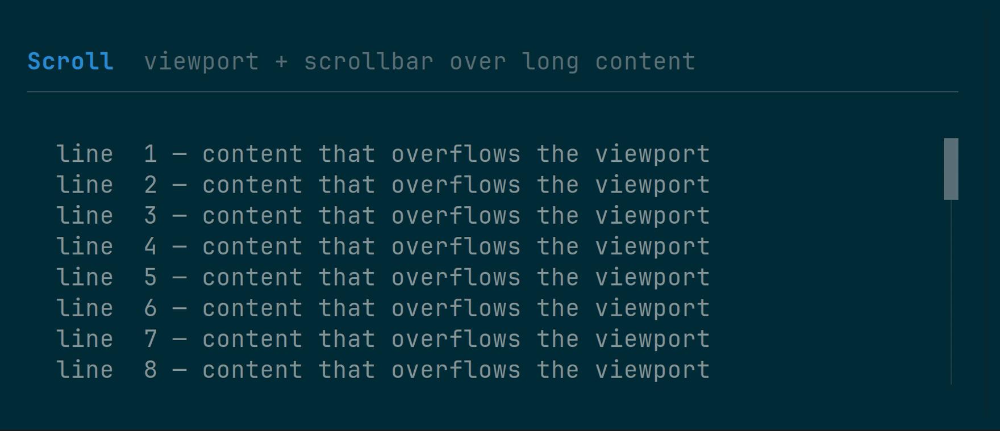

```rust
use tuika::prelude::*;
let mut state = ScrollState::new();          // held by the host across frames
state.handle(&event, content_h, viewport_h); // built-in wheel/paging, or…
state.set_offset(app.scroll_row);            // …mirror an app-owned row, and
state.set_x_offset(app.scroll_col);          // …pan wide lines left/right
state.clamp_x(widest_line_w, viewport_w);    // keep the pan within the content
view! { node(Scroll::new(lines, &state).wrap(true)) }
```

#### Following a stream

Content that grows while it is being read — a transcript, a log tail, a
streaming answer — wants to show the newest rows *until the reader scrolls away
from them*. That is not a mode to implement; it falls out of two calls:

```rust
use tuika::prelude::*;
let mut state = ScrollState::new();

// Once per frame, after appending: pins the offset to the newest content while
// the state is stuck to the bottom, and leaves a scrolled-back reader alone.
state.clamp(content_h, viewport_h);

// Scrolling up releases the stick; reaching the bottom again re-arms it.
state.handle(&event, content_h, viewport_h);

// Read it back to tell the reader which they are.
let live = state.is_stuck_to_bottom();
```

`examples/markdown.rs` runs exactly this over a streaming `MarkdownState`.

### `ItemScroll`

The same viewport over **items** instead of lines: `Vec<Element>`, each measured
at the render width and stacked with an optional `gap`. Scrolling is by row, not
by item, so an entry taller than the space left clips at the viewport edge and
scrolls through it — which is what a chat transcript, a feed, or any history of
laid-out things needs. Reach for `Scroll` when the content really is lines
(logs, prose); reach for this when an entry is a panel, a table, a diff, or a
nested layout. `measure_height` reports the row count so the host can reconcile
its `ScrollState` before painting, and `windowed` takes just the visible slice
plus the true height for lists too long to measure every frame.
[API](https://docs.rs/tuika/latest/tuika/components/struct.ItemScroll.html)

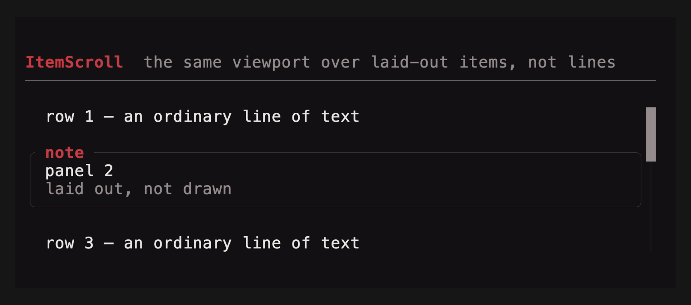

```rust
use tuika::prelude::*;
let items: Vec<Element> = history.iter().map(|entry| entry.view()).collect();
let ctx = RenderCtx::new(&theme).with_sheet(sheet);
let content_h = ItemScroll::measure_height(&items, width, 1, true, &ctx);
state.clamp(content_h, viewport_h);          // reconcile before the paint
view! { node(ItemScroll::new(items, &state).gap(1)) }
```

### `Viewport` + `ScrollState`

A two-dimensional clipped window over any child `Element`, rather than only
line content. The host supplies the child's full cell extent and persists
vertical/horizontal offsets in `ScrollState`; optional right and bottom
scrollbars track the clamped window. Wide grapheme clusters are never painted
halfway across either clipped edge.
[API](https://docs.rs/tuika/latest/tuika/components/struct.Viewport.html)

```rust
use tuika::prelude::*;
let view = Viewport::new(element(markdown_or_grid), Size::new(120, 80), &scroll)
    .horizontal_scrollbar(true);
```

### `Form` + `FormField` + `FormState`

Responsive labeled controls with help and validation rows. Labels share a
column on wide terminals and stack above controls on narrow terminals.
`FormState` handles focus traversal and submit/cancel outcomes; control values
remain in their normal host-owned state.
[API](https://docs.rs/tuika/latest/tuika/components/struct.Form.html)

```rust
use tuika::prelude::*;
let form = Form::new(vec![
    FormField::new("Name", element(name_input)).help("Shown publicly"),
    FormField::new("Mode", element(mode_select)).error(validation_error),
], &form_state);
```

### `Scene` + `Dialog`

`Scene` owns a base tree and ordered overlays. Screen anchors place dialogs and
other independent layers; `SceneOverlay::target` uses a `RectProbe` to follow a
laid-out trigger for popovers, menus, and tooltips, with side selection,
alignment, gap, edge-aware flipping, and screen clamping. `Dialog` builds a
centered modal from ordinary Tuika elements, with optional action hints,
min/max sizing, clear or dimmed backdrops, and top-layer focus ownership.
[Scene API](https://docs.rs/tuika/latest/tuika/scene/struct.Scene.html) ·
[Dialog API](https://docs.rs/tuika/latest/tuika/components/struct.Dialog.html)

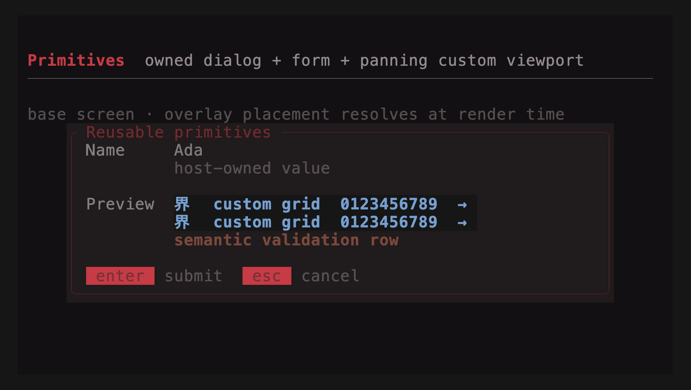

```rust
use tuika::prelude::*;
let scene = Scene::new(element(base)).dialog(
    Dialog::new("Confirm", element(Text::raw("Continue?")))
        .key_hints([("enter", "yes"), ("esc", "no")])
        .dim_backdrop(true)
        .focus_owner("confirm"),
);
```

### Dialog presets

`ConfirmDialog`, `ChoiceDialog`, `MultiChoiceDialog`, and `InputDialog` assemble
the common modal flows from `Dialog`, selection controls, and text input. Their
paired state types remain host-owned and return the same `InputOutcome` used by
the lower-level components. Every preset converts to `Dialog`, so it works
with `Scene::dialog` and remains customizable through its builders.
[Confirm API](https://docs.rs/tuika/latest/tuika/components/struct.ConfirmDialog.html)

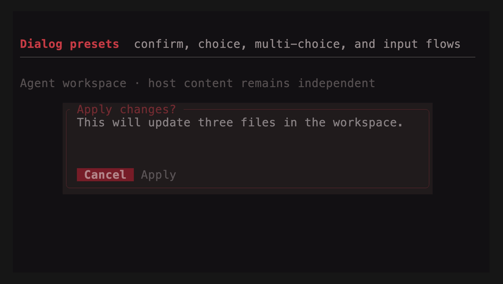

```rust
use tuika::prelude::*;
let mut state = ConfirmDialogState::new(); // Cancel is the safe default
let outcome = state.handle(&event);
let scene = Scene::new(element(base)).dialog(
    ConfirmDialog::new("Apply changes?", "Update three files?", &state)
        .confirm_label("Apply")
        .focus_owner("confirm")
        .into_dialog(),
);
```

### `DrawView` / `CanvasView`

A closure-backed escape hatch for custom cell drawing. Its callback receives
the assigned area, clipped `Surface`, and `RenderCtx`, and composes as a normal
view. For application regions that also need custom intrinsic measurement,
`view_fn(measure, render)` is available from the crate root and prelude; both
closures may borrow frame-scoped application state.
[Inline view API](https://docs.rs/tuika/latest/tuika/fn.view_fn.html) ·
[Draw view API](https://docs.rs/tuika/latest/tuika/view/struct.DrawView.html)

```rust
use ratatui::layout::Rect;
use tuika::{RenderCtx, Surface};
use tuika::view::DrawView;
let chart = DrawView::new(
    |area: Rect, surface: &mut Surface<'_>, ctx: &RenderCtx<'_>| {
        surface.set_string(area.x, area.y, "▁▃▆█", ctx.theme.success_style());
    },
);
```

### `SelectList` + `SelectState`

A selectable list; `SelectState` navigates with the arrow keys (wrapping),
confirms on Enter, cancels on Esc. `new()` and `default()` select the first row;
`SelectState::unselected()` starts cursorless, and `state.select(None)` clears an
existing selection so neither caret nor highlight is drawn. `.selection_style(style)`
overrides the theme selection style for one list, and
`.selection_anchor(SelectionAnchor::Edge)` scrolls only when the selection would
leave the window instead of recentering on it. `handle_with` accepts a
`SelectNavigation` policy; `SelectNavigation::common()` enables j/k, Ctrl+N/P,
Tab/Shift+Tab, and numeric shortcuts. `handle_mouse` hit-tests explicit list
bounds and a viewport offset. `MultiSelectState` adds Enter/Space/click toggling
for pickers that retain several checked items. The runnable
[`select` example](https://github.com/everruns/tuika/blob/main/examples/select.rs)
combines every navigation mode in one picker.

For a long-lived viewport, use `SelectViewportState`. Its `resolve` method
returns one exact `VirtualWindow`: pass that value to
`SelectList::visible_window` (or `Table::visible_window`) and back to
`handle_mouse`. The top row then persists, moving only when keyboard selection
crosses an edge; clicking a visible lower row does not recenter it. After a
resize or collection refresh, call `resolve` again to clamp both selection and
window. Existing `.viewport(rows)` remains selection-centered for compatibility;
migrate when the host needs stable scroll position or precise post-render mouse
mapping.
[API](https://docs.rs/tuika/latest/tuika/components/struct.SelectList.html)

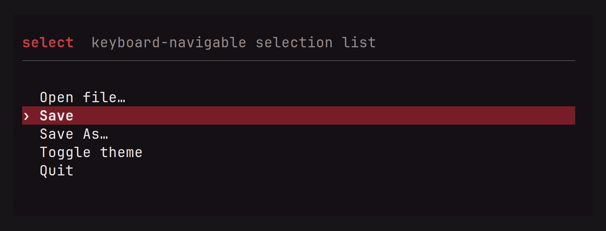

```rust
use ratatui::style::{Color, Style};
use tuika::prelude::*;
let mut state = SelectState::unselected();
let style = Style::default().fg(Color::Blue);
state.select(Some(0)); // select a row when the host is ready
view! { node(SelectList::new(items, &state).selection_style(style)) }
```

```rust
let mut state = SelectViewportState::new();
let window = state.resolve(items.len(), body_rows);
let list = SelectList::new(items, state.selection()).visible_window(window);
let outcome = state.handle_mouse(&event, item_count, body_bounds, window);
```

### `TreeList` + `TreeState`

A domain-neutral tree over host-produced depth-first `TreeRow`s. Rows retain
stable ids, labels, parent ids, depth, and an `expandable` flag; recursive model
traversal and label heuristics stay in the application. `TreeState` owns generic
expansion, stable-id selection, Up/Down navigation, Left collapse-or-parent,
Right expand, Enter toggle, mouse selection/disclosure toggling, and a persistent
scroll window with a scrollbar. Refreshes and reorder preserve the selected id;
when it becomes hidden or disappears, selection falls back to its nearest
visible remembered ancestor.
[API](https://docs.rs/tuika/latest/tuika/components/struct.TreeList.html) ·
[`tree_list` example](https://github.com/everruns/tuika/blob/main/examples/tree_list.rs)

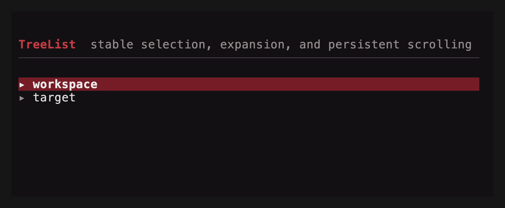

```rust
let rows = vec![
    TreeRow::root(1, "workspace", true),
    TreeRow::new(2, Some(1), 1, "src", false),
];
let mut state = TreeState::with_selected(1);
let window = state.resolve(&rows, body_rows);
let tree = TreeList::new(&rows, &state).visible_window(window);
```

### `CompletionPalette` + `CompletionState`

A reusable completion surface for slash commands, mentions, files, models, or
any host-provided candidates. `CompletionState::sync` fuzzy-ranks labels,
details, and hidden keywords; changed queries select the best result, while an
unchanged query preserves selection across candidate refreshes. The selected
`CompletionItem` exposes replacement text for the host to insert. Use
`show_query(true)` for a standalone command palette, or omit it for an editor-
anchored popup.
[API](https://docs.rs/tuika/latest/tuika/components/struct.CompletionPalette.html)

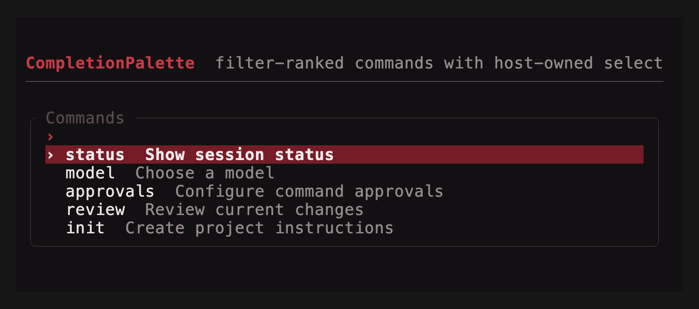

```rust
use tuika::prelude::*;
let items = vec![
    CompletionItem::new("model").detail("Choose a model").replacement("/model"),
    CompletionItem::new("status").detail("Show session status").replacement("/status"),
];
let mut state = CompletionState::new();
state.sync(active_token.query(), &items);
let palette = CompletionPalette::new(&items, &state).title("Commands");
if state.handle(&event) == InputOutcome::Submitted {
    editor.replace_token(&active_token, state.selected(&items).unwrap().replacement_text());
}
```

### `Table` + `SelectState`

The multi-column peer of `SelectList` — the widget behind repo/branch/worktree
browsers, process and container lists, and file explorers: a header row,
per-column width policy, a full-row selection highlight, a caret gutter, and
windowed scrolling. Column widths come from the same flexbox `solve` as every
other container — a `Column` is `fixed`, `auto` (widest cell), or `flex`
(shares leftover width). Selection reuses `SelectState`, so a list and a table
share one state type. The table windows to its assigned height by default;
`.viewport(rows)` is only an optional upper bound. Chrome follows the theme by
default but is overridable (the `Boxed::border_color` pattern): `.caret(char)`
sets the gutter marker,
`.header_style(Style)` restyles the header, `.selection_style(Style)` controls
one table's selection band (including modifiers), and
`.preserve_selection_fg(true)` keeps color-coded columns' own colors under the
selection highlight. `.selection_anchor(SelectionAnchor::Edge)` swaps the
stateless windowing policy from "recenter on the selection" (the default,
`SelectionAnchor::Center`) to "move only when the selection would leave the
window".
[API](https://docs.rs/tuika/latest/tuika/components/struct.Table.html)

```rust
use ratatui::style::{Color, Style};
use ratatui::text::Line;
use tuika::prelude::*;
let mut state = SelectState::new();
state.handle(&event, rows.len());
let style = Style::default().fg(Color::Blue);
let columns = vec![Column::auto("branch"), Column::fixed("ahead", 5), Column::flex("subject", 1)];
view! { node(Table::new(columns, rows, &state).selection_style(style).caret('▶')) }
```

### `KeyedTable` + `KeyedSelectState`

A virtualized table for large, changing host collections. It borrows domain
rows for one frame—either directly from a slice or through a
`KeyedRowSource<K>` that maps visible indices into authoritative storage—and
calls each `KeyedColumn` only for the visible window. Row data is not cloned
into widget-owned cells. `KeyedSelectState<K>` and
`KeyedMultiSelectState<K>` store application keys rather than positions, so a
selection follows the same record through reorder, insertion, filtering, and
streaming refreshes. Keys must be unique within the authoritative collection.
Filtering preserves absent keys; call `retain_present`
or `retain_present_source` with the authoritative collection when records are
truly deleted.

Columns support fixed, auto, and flex sizing, trailing alignment,
`hide_below(width)` breakpoints, and optional-column shedding. Styled borrowed
`Line`s remain styled, with `preserve_selection_fg(true)` retaining semantic
cell colors under the cursor band, while the built-in caret/check gutter covers
common leading indicators. Keyboard aliases reuse `SelectNavigation`; Page
Up/Down, Home/End, wheel scrolling, explicit mouse hit-testing, and configurable
scroll margin share `VirtualWindow` geometry. Hosts with a key-to-position index
can pass `selected_index` to avoid a collection scan without making the index
persistent identity.

For searchable application rows, `KeyedRowSource::key_eq` compares a projected
row directly with the owned selection key. Composite identity such as
`(Agent, session_id)` therefore needs no copied key per visible row, while
`NavigableKeyedRowSource::key` materializes one only when keyboard or mouse
input selects a row. The `*_indexed` column constructors receive the visible
row index, which joins parallel fuzzy positions or other decoration metadata
without a cached wrapper model. The runnable
[`keyed_table` example](https://github.com/everruns/tuika/blob/main/examples/keyed_table.rs)
uses an AGF-shaped `Vec<Session>` plus `Vec<usize>` visible order and parallel
fuzzy positions; it reorders, filters, inserts, and deletes rows while
composite-key selection stays stable.
[API](https://docs.rs/tuika/latest/tuika/components/struct.KeyedTable.html)

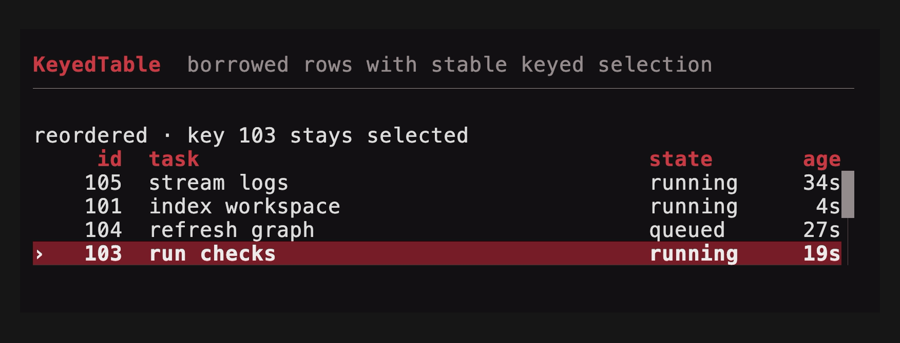

```rust
use tuika::prelude::*;
struct Job { id: u64, name: String }
fn key(job: &Job) -> &u64 { &job.id }
fn name(job: &Job) -> Line<'_> { Line::from(job.name.as_str()) }

let state = KeyedSelectState::with_selected(42);
let columns = vec![KeyedColumn::flex("job", 1, name)];
let table = KeyedTable::new(columns, &jobs, key, &state);
```

An indirect source replaces per-frame wrapper construction. Counting nonblank
Rust source lines exactly as shown, the per-frame caller falls from **20 LOC to
8 LOC** (−60%); the source's trait implementation is one-time and shared by
rendering, keyboard navigation, mouse hit-testing, and deletion reconciliation.

Before—copied composite keys and metadata in wrapper rows:

```rust
struct VisibleSession<'a> {
    session: &'a Session,
    key: SessionKey,
    fuzzy: &'a [usize],
}
let rows = visible.iter().enumerate().map(|(row, &source)| {
    VisibleSession {
        session: &sessions[source],
        key: sessions[source].key(),
        fuzzy: &fuzzy[row],
    }
}).collect::<Vec<_>>();
let table = KeyedTable::new(
    vec![KeyedColumn::flex("summary", 1, |row: &VisibleSession<'_>| {
        highlighted(&row.session.summary, row.fuzzy)
    })],
    &rows,
    |row| &row.key,
    &state,
);
```

After—authoritative rows and parallel metadata stay in place:

```rust
let source = SessionRows { sessions: &sessions, visible: &visible };
let table = KeyedTable::source(
    vec![KeyedColumn::flex_indexed("summary", 1, |row, session: &Session| {
        highlighted(&session.summary, &fuzzy[row])
    })],
    &source,
    &state,
);
```

### `Tabs` + `TabsState`

A one-line tab strip; `TabsState` handles left/right and tab navigation.
[API](https://docs.rs/tuika/latest/tuika/components/struct.Tabs.html)

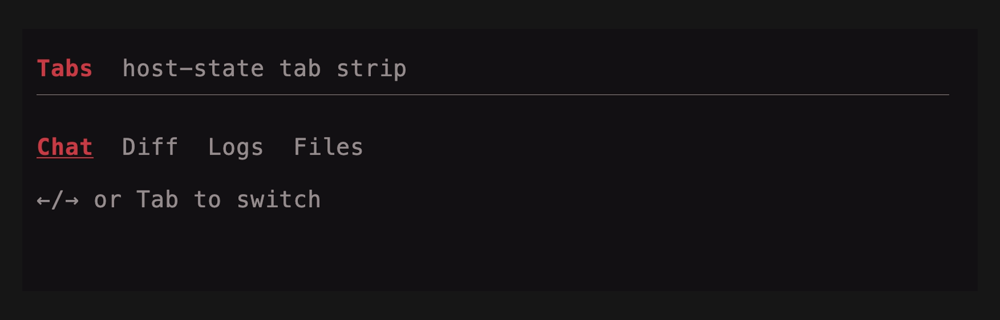

```rust
use tuika::prelude::*;
let mut state = TabsState::default();
state.handle(&event, labels.len());
view! { node(Tabs::new(labels, &state)) }
```

### `TabSelect` + `TabSelectState`

A value-selecting segmented control (as opposed to `Tabs`, which is navigation
chrome): moving the cursor changes the selected value immediately, and
Enter/Space activates it. `handle` returns the shared `InputOutcome`,
distinguishing a change from submission while the state owns the selected value.
[API](https://docs.rs/tuika/latest/tuika/components/struct.TabSelect.html)

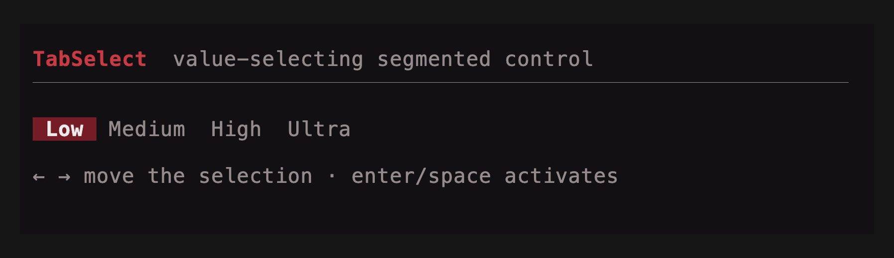

```rust
use tuika::prelude::*;
let mut state = TabSelectState::default();
state.handle(&event, labels.len());
view! { node(TabSelect::new(labels, &state)) }
```

### `Slider` + `SliderState`

A one-row value picker over a numeric range with a filled track and thumb.
`SliderState` clamps to `min..=max`, steps via the arrow keys (Home/End snap to
the bounds), and `set_ratio` maps a click position to a value.
[API](https://docs.rs/tuika/latest/tuika/components/struct.Slider.html)

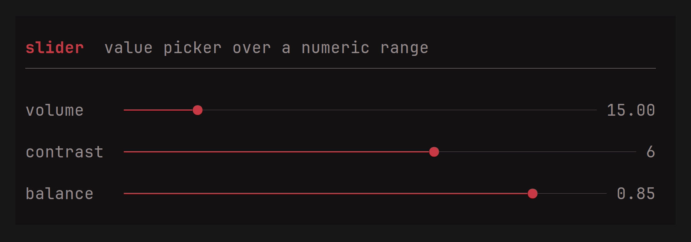

```rust
use tuika::{Slider, SliderState, view};
let mut state = SliderState::new(0.0, 100.0, 40.0).step(5.0);
state.handle(&event);
view! { node(Slider::new(&state).label(&state)) }
```

### `TextInput` + `TextInputState`

A multi-line edit model: buffer, cursor, editing, and soft-wrap. `TextInput`
renders a snapshot; the host places the terminal cursor from
`TextInputState::cursor_screen`. Configure Enter vs Shift+Enter with
`TextInputMode` (`SubmitOnEnter` by default): the other chord inserts a newline.
Ctrl+J always inserts a newline (raw-mode LF from terminals without enhanced
keyboard reporting). `placeholder` fills an empty buffer, and `highlights` paints
host-computed `TextSpan` ranges over the text. Cursor and span coordinates remain
char indices for host interoperability; movement and deletion keep grapheme
clusters intact, and wrapping/cursor placement use terminal-cell width so CJK
and emoji align with the rendered grid.
For search fields and command bars, `SingleLineInputState` wraps the same editor
but guarantees one line: setters and paste normalize CR/LF to spaces, Enter and
Ctrl+J submit, and `text()` returns a borrowed `&str` without allocation. Render
it with `TextInput::new(state.as_text_input())`.

Like the other interactive state types, `handle` returns `InputOutcome`:
`Changed` means persistent state moved, `Consumed` means a recognized action hit
a bound, `Submitted`/`Cancelled` report lifecycle intent, and only `Ignored`
should continue through input routing. The edited text remains in the state.
[API](https://docs.rs/tuika/latest/tuika/components/struct.TextInput.html)

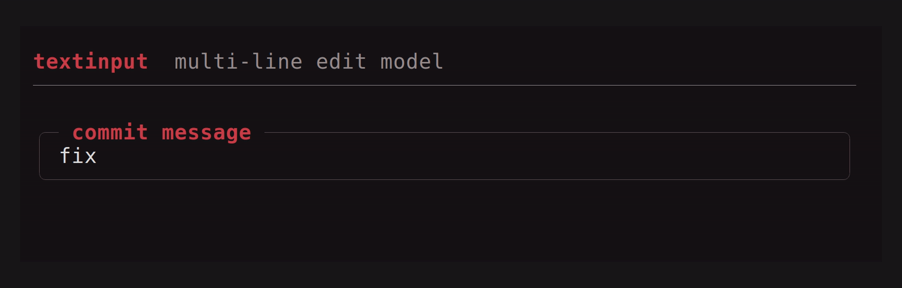

```rust
use tuika::{TextInput, TextInputMode, TextInputState, view};
let mut state = TextInputState::from_text("");
state.set_mode(TextInputMode::SubmitOnEnter);
view! {
    boxed(title = " commit message ") {
        node(TextInput::new(&state))
    }
}
```

#### Inline tokens: `@mentions`, `/commands`, anything

A composer usually wants more than plain text: a `@` that completes a file, a
`/` that opens a command palette, a `#` that links an issue. `Trigger` declares
*where* an opening character counts (`TriggerAnchor::{Anywhere, WordStart,
LineStart, BufferStart}`) and whether the token stops at whitespace; the state
finds them. What they **mean** — which popup opens, what completes, how they are
colored — stays in the host, so any app can define its own set.

```rust
use tuika::{TextInput, TextInputState, Trigger, TriggerAnchor};

let triggers = [
    Trigger::new('/').anchor(TriggerAnchor::BufferStart), // a command palette
    Trigger::new('@'),                                    // a file mention
];

if let Some(token) = state.active_token(&triggers) {      // cursor inside one?
    let rows = complete(token.trigger, token.query());    // host's own source
    // …and on confirm, splice the choice back in:
    state.replace_token(&token, "@src/lib.rs ");
}

// Color every token, whether or not the cursor is in it.
let spans = state.tokens(&triggers).iter().map(|t| t.span(mention_style)).collect();
view! { node(TextInput::new(&state).highlights(spans)) }
```

---

[All components](../components.md)
