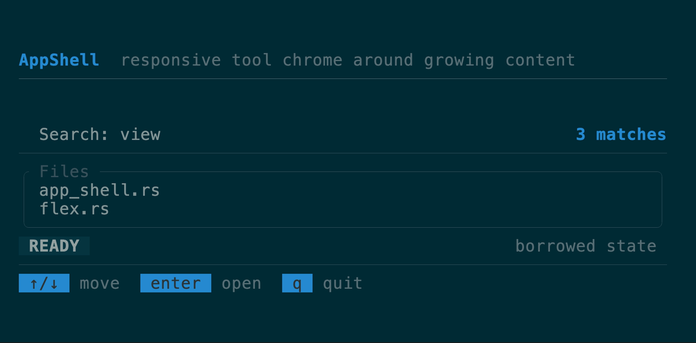
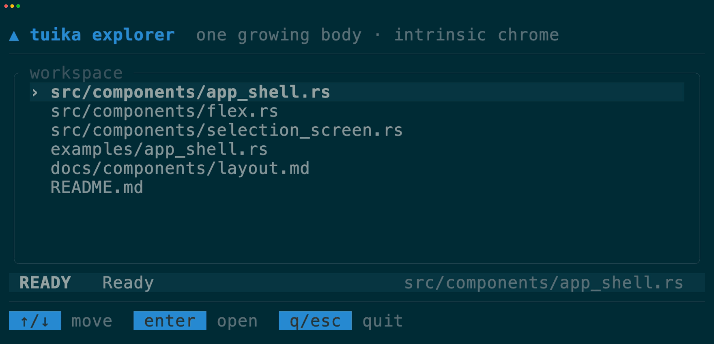
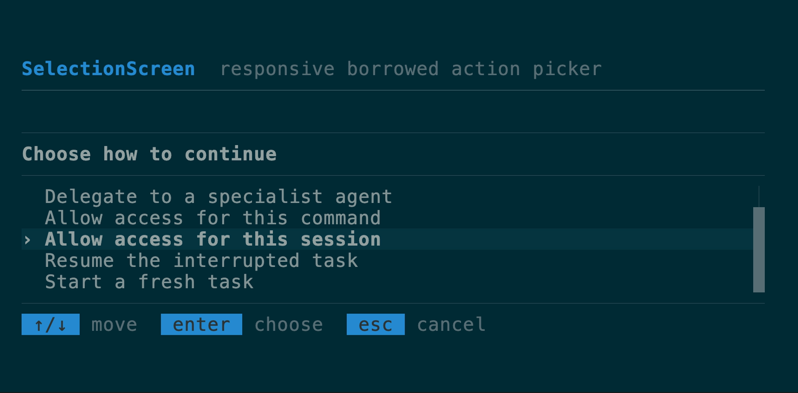
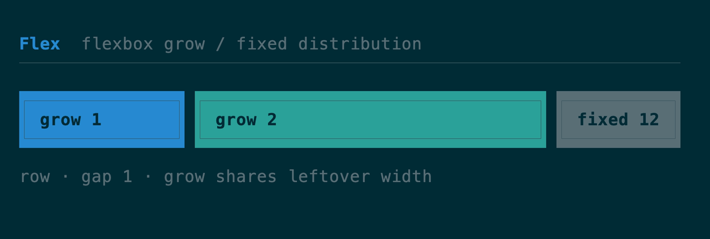
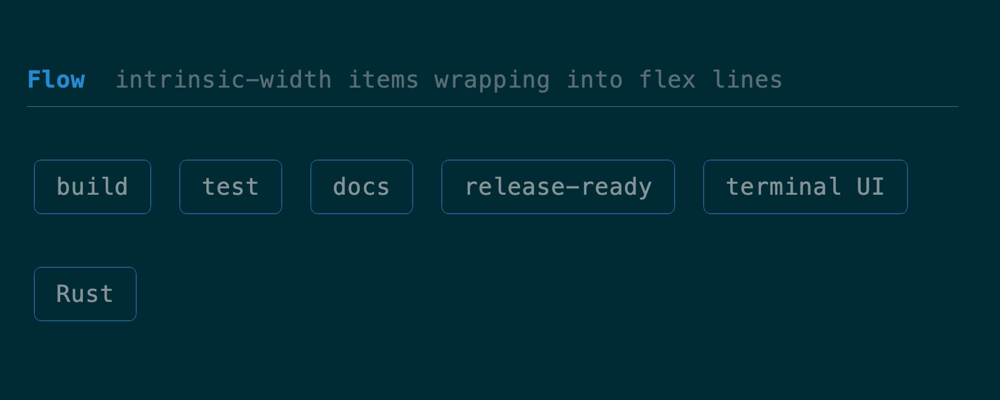
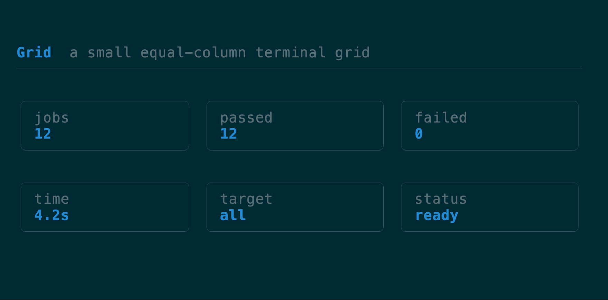
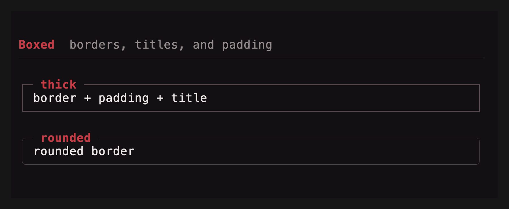
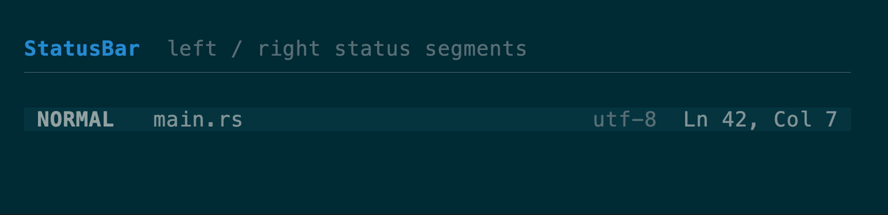
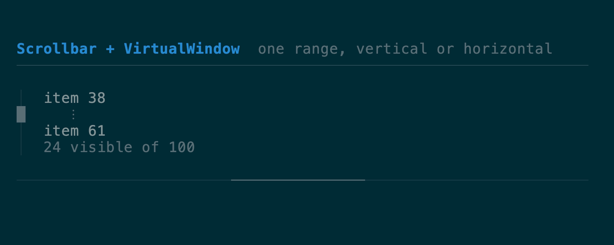

# Layout components

[All components](../components.md)

See the [layout guide](../layout.md) for wrapping, grow/shrink, line alignment,
measurement requests, migration notes, and choosing Flex, Flow, or Grid.

### `AppShell`

A compact application frame for tool-style TUIs: intrinsic header and status
regions, optional theme-aware rules, one growing main view, and a footer that
fits `KeyHints` or any custom view. Every region is optional except main;
`before_main` and `after_main` accept borrowed views and preserve call order
when an application needs different chrome. On short screens rules and status
collapse before the one-row main/footer minimums; width-sensitive children
receive the terminal's actual width.
[API](https://docs.rs/tuika/latest/tuika/components/struct.AppShell.html)



```rust
use tuika::prelude::*;

let screen = AppShell::new(content)
    .header(Text::raw("my tool"))
    .top_rule()
    .status(StatusBar::new().left(status_spans))
    .bottom_rule()
    .footer(KeyHints::from_keymap(&keymap));
```

The [complete runnable example](https://github.com/everruns/tuika/blob/main/examples/app_shell.rs)
keeps selection and input in application state while rebuilding the borrowed
shell view each frame. Run it with `cargo run --example app_shell`; resize the
terminal to see rules and secondary chrome yield before the main body and
footer.

The recording drives that real application: selection moves through the growing
body, submission updates the status region, and the shell keeps its intrinsic
chrome around the host-owned state.



#### `AppShell` or `Flex`?

Use `AppShell` when the application has one growing body surrounded by
intrinsic header, status, rule, and footer rows. It supplies that vertical
allocation and its short-terminal collapse policy; it does not own navigation,
input routing, or application state.

Use `Flex` directly when several regions need to grow, split an axis, or change
shape responsively — sidebars, editor panes, dashboards, and nested panel
grids. The [Workbench example](../showcases.md#workbench-demo-in-repo-example)
uses nested `Flex` for that multi-pane shape. The two compose normally: an
`AppShell` main body can itself be a `Flex` tree.

### `SelectionScreen`

A responsive full-screen picker for the repeated action, agent, permission,
and resume shape: optional leading rule, heading-styled header, separator,
selectable body, optional trailing rule, and a `KeyHints` footer. It composes
`AppShell`, the same row renderer as `SelectList`, `SelectState`, and semantic
theme roles. The body automatically windows to its allocated height, keeping
the current selection visible on short terminals. `borrowed` reuses a host row
slice without cloning; `windowed` accepts only a host-supplied `VirtualWindow`;
`new` owns rows. Header and footer builders accept custom
owned or frame-borrowed views, and per-instance header/selection styles remain
available without embedding an application palette.
[API](https://docs.rs/tuika/latest/tuika/components/struct.SelectionScreen.html)



```rust
use tuika::prelude::*;

let screen = SelectionScreen::borrowed("Select an action", &rows, &state)
    .leading_rule()
    .trailing_rule()
    .footer(KeyHints::from_keymap(&keymap));
```

The compilable [AGF-shaped example](https://github.com/everruns/tuika/blob/main/examples/selection_screen.rs)
measures the caller expression exactly: **8 nonblank LOC before, 4 after**.
The before form clones the row vector into `SelectList`; the after form borrows
it and derives virtualization from the allocated body height.

### `Flex`

The flexbox container and composition primitive — `grow(n)` children share
leftover space by weight, `fixed(n)` reserve exact size, with `gap` and
`padding`. It *is* the `view!` DSL's `row`/`col`. `element` and `view!` preserve
frame borrows through nested Flex and Boxed containers as `ScopedElement<'_>`;
owned trees continue to use `Element` without lifetime annotations.
[API](https://docs.rs/tuika/latest/tuika/components/struct.Flex.html)



```rust
use tuika::prelude::*;
view! {
    row(gap = 1) {
        grow(1) { node(left) }
        fixed(12) { node(right) }
    }
}
```

Need the child rects *before* (or without) painting — to size a scroll region
to a pane's real height, hit-test a click, or decide what fits? `Flex::solve`
runs the same measure-then-solve pass render uses and returns one `Rect` per
child, painting nothing. Padded containers measure children against the inner
box, and a `Flex` measured as an `Auto` child honors its own fixed and percent
dimensions. The underlying flexbox solver is also callable directly as
`tuika::layout::solve(area, &style, &items)` for layouts built without a `Flex`.

```rust
use tuika::prelude::*;
use ratatui::layout::Rect;

let flex = Flex::row()
    .fixed(8, element(Text::raw("sidebar")))
    .grow(1, element(Text::raw("content")));
let theme = Theme::default();
let ctx = RenderCtx::new(&theme);
let rects = flex.solve(Rect::new(0, 0, 40, 10), &ctx); // [sidebar_rect, content_rect]
```

`FlexItemStyle` separates child-owned basis/grow/shrink/min/max/`align_self`
from container-owned direction, wrapping, gaps, justification, and line
alignment. `Flex::wrap(FlexWrap::Wrap)` forms flex lines; positive and negative
free space are distributed by weight with exact cell-boundary rounding.

### `Flow`

A row-oriented wrapping flex container for tags, actions, and other items whose
intrinsic widths decide the line breaks.
[API](https://docs.rs/tuika/latest/tuika/components/struct.Flow.html)



```rust
use tuika::prelude::*;
let flow = Flow::new()
    .gap(1)
    .item(element(Text::raw("build")))
    .item(element(Text::raw("release-ready")));
```

### `Grid`

A deliberately small equal-column, row-major terminal grid with intrinsic row
heights, independent gaps, padding, and exact boundary rounding. It omits CSS
Grid's named lines, implicit tracks, spanning, and dense packing.
[API](https://docs.rs/tuika/latest/tuika/components/struct.Grid.html)



```rust
use tuika::prelude::*;
let grid = Grid::new(3)
    .gap(1)
    .cell(element(Text::raw("one")))
    .cell(element(Text::raw("two")));
```

### `Boxed`

A border + padding + title wrapping one child. The border color is focus-aware
by default (theme `border` / `border_focused`); `border_color(Color)` overrides
that with an explicit color for semantic frames — an accent or danger modal, or
a per-pane color a host resolves itself. An optional `title_bottom` rides the
bottom border — the slot for a `1 of 3` position counter, a footer legend, or a
hint. Both titles honor their `Line` alignment; unset, the top title is
flush-left and the bottom title flush-right. Titles begin one cell after the
corner and truncate before the opposite corner, matching ratatui `Block`.
The stylesheet's panel padding participates in measurement and rendering;
`.padding(...)` on this instance takes precedence.
[API](https://docs.rs/tuika/latest/tuika/components/struct.Boxed.html)



```rust
use tuika::prelude::*;
view! {
    boxed(title = " title ", title_bottom = " 1/3 ", border = BorderStyle::Rounded) {
        node(child)
    }
}
```

### `FocusScope`

A layout-transparent wrapper that renders its subtree with an explicit focus
flag. Focus lives on the render context and `paint` uses one root context, so a
`Flex` can't hand a single child `focused = true`; wrap each pane in a
`FocusScope` so the active one's `Boxed` border lights up while the others stay
dim — independently of the frame's root focus.
For click-to-focus panes, register stable ids in `FocusRegistry`, resolve the
clicked pane through a `HitMap`, then call `focus(id)`. Unknown ids and requests
made while an overlay owns input are rejected, and the original registration
order remains the Tab/BackTab ring.
[API](https://docs.rs/tuika/latest/tuika/components/struct.FocusScope.html)

```rust
use tuika::prelude::*;
view! {
    row(gap = 1) {
        grow(1) { node(FocusScope::focused(element(Boxed::new(element(Text::raw("active")))))) }
        grow(1) { node(FocusScope::unfocused(element(Boxed::new(element(Text::raw("idle")))))) }
    }
}

if let Some(pane) = pane_hits.hit(mouse.column, mouse.row) {
    focus.focus(pane);
}
```

### `StatusBar`

One row with left- and right-anchored segment groups.
[API](https://docs.rs/tuika/latest/tuika/components/struct.StatusBar.html)



```rust
use tuika::prelude::*;
view! {
    node(StatusBar::new().left(left_spans).right(right_spans))
}
```

### `Scrollbar` + `VirtualWindow`

One clamped window model and one scrollbar renderer for vertical or horizontal
collections. `VirtualWindow::around` keeps an absolute selection visible;
`range()` lets a host fetch only the current records. `SelectList::windowed`
and `Table::windowed` accept that slice directly, preserving absolute selection
and scrollbar geometry without cloning the full collection.
[Scrollbar API](https://docs.rs/tuika/latest/tuika/components/struct.Scrollbar.html) ·
[VirtualWindow API](https://docs.rs/tuika/latest/tuika/components/struct.VirtualWindow.html)



```rust
use tuika::prelude::*;
let window = VirtualWindow::around(total, viewport_rows, state.selected());
let rows = window.range().map(|index| load_row(index)).collect();
view! { node(SelectList::windowed(rows, window, &state)) }
```

---

[All components](../components.md)
