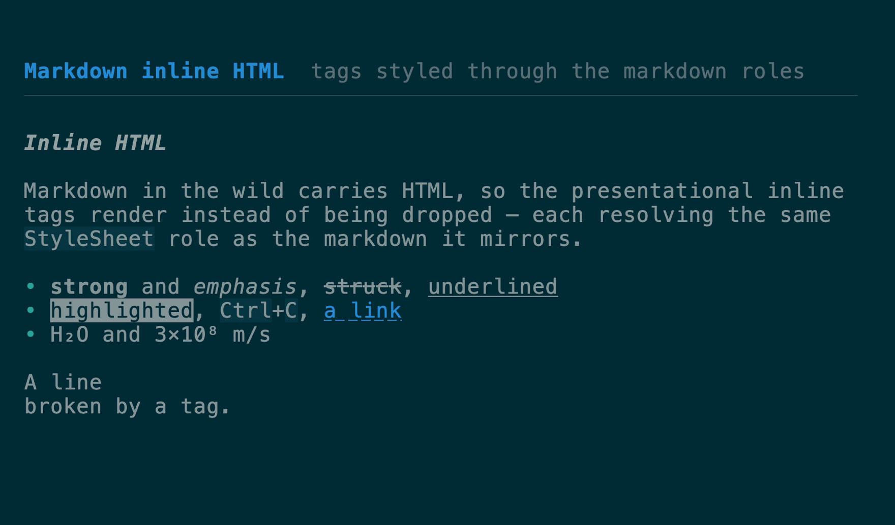
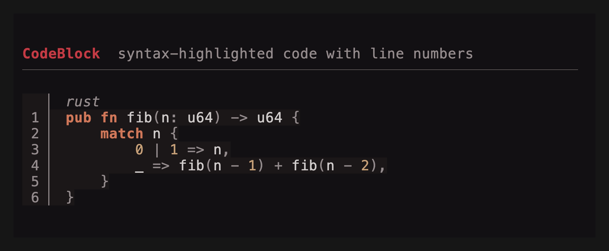
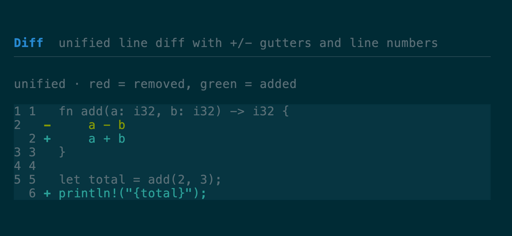

# Markdown & code components

[All components](../components.md)

### `Markdown` + `MarkdownState`

Renders CommonMark (plus GFM tables and strikethrough) to styled lines —
word-wrapping prose and fitting code and tables to the render width.
`MarkdownState` adds incremental rendering for streaming text. See the
[markdown guide](../markdown.md) for streaming, tables, fenced-block renderers,
highlighting, links, and images.
[API](https://docs.rs/tuika/latest/tuika/components/markdown/index.html)


The presentational inline HTML tags render too — `<b>`, `<em>`, `<code>`,
`<kbd>`, `<mark>`, `<a>`, `<br>`, `<sub>`/`<sup>` — each resolving the same
`StyleSheet` role as the markdown it mirrors. Block-level HTML is a seam; see
[Inline HTML](../markdown.md#inline-html).



### `Html`

Renders an HTML fragment to styled lines: headings, paragraphs, lists,
definition lists, block quotes, `<pre>`, `<hr>`, `<table>`,
`<details>`/`<summary>`, and the presentational inline elements. Every element
resolves a `StyleSheet` role, so HTML inherits the app's theme like everything
else. No CSS — this renders content, not pages. Ships in the companion crate
[`tuika-html`](../../crates/tuika-html/), which also supplies the
`MarkdownBlockRenderer` that lays out HTML blocks inside
[Markdown](../markdown.md#block-html).
[API](https://docs.rs/tuika-html/latest/tuika_html/struct.Html.html)


### `CodeBlock`

A themed, syntax-highlighted fenced block: a language label, a left rail, and a
code background. Highlighting comes from a pluggable `Highlighter` (none → plain,
theme-colored text); the `tuika-codeformatters` crate ships a tree-sitter one. An
optional line-number gutter (`line_numbers(true)` / `start_line(n)`) rides to the
left of the rail.
[API](https://docs.rs/tuika/latest/tuika/components/struct.CodeBlock.html)



```rust
use tuika::prelude::*;
view! {
    node(CodeBlock::new("rust", "fn main() {}").highlighter(&highlighter).line_numbers(true))
}
```

### `Diff`

A line-oriented diff (LCS) rendered **unified** (`+`/`-`/` ` gutters) or
**side-by-side**, with an optional line-number gutter. Base, row, gutter, and
divider colors resolve from semantic styling; `DiffStyle` is the per-instance
override. The pure `diff::rows(old, new)` classifier is reusable on its own.
[API](https://docs.rs/tuika/latest/tuika/components/diff/struct.Diff.html)



```rust
use tuika::prelude::*;
view! {
    node(Diff::new(old, new).mode(DiffMode::SideBySide).line_numbers(true))
}
```

---

[All components](../components.md)
