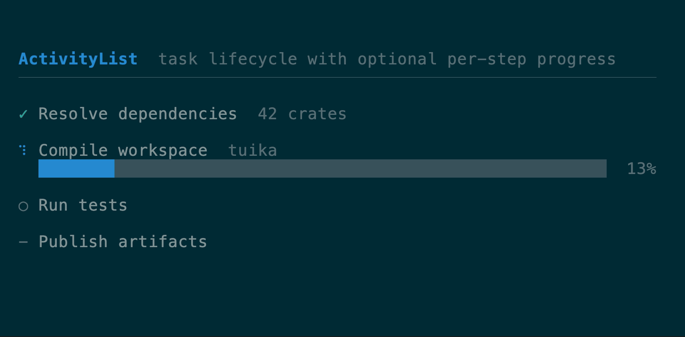

# Motion components

[All components](../components.md)

Animated from a host-supplied frame counter (see the [`anim`](https://docs.rs/tuika/latest/tuika/anim/index.html) module).

### `Spinner`

A frame-cycled activity glyph — `Braille` (smooth default), `Line` (ASCII
fallback), or `Dots`. [API](https://docs.rs/tuika/latest/tuika/components/struct.Spinner.html)


```rust
use tuika::prelude::*;
view! {
    row(gap = 1) {
        node(Spinner::new(frame).style(SpinnerStyle::Braille))
        text("working…")
    }
}
```

### `ProgressBar`

A single-row bar: determinate (sub-cell eighth-block fill, optional `NN%`) or an
indeterminate marquee driven by the frame counter. `.label("…")` overlays a
centered caption and clips it on narrow terminals; `.colors(filled, track)` and
`.label_style(Style)` override the theme defaults for a host whose bar has its
own palette.
[API](https://docs.rs/tuika/latest/tuika/components/struct.ProgressBar.html)


```rust
use tuika::prelude::*;
view! {
    col(gap = 1) {
        node(
            ProgressBar::determinate(0.6)
                .label("0:42/3:07")
                .label_style(Style::default().fg(Color::Cyan).add_modifier(Modifier::ITALIC))
                .percent(true),
        )
        node(ProgressBar::indeterminate(frame))
    }
}
```

### `ActivityList`

A vertical lifecycle view for multi-step work: queued, running, succeeded,
failed, or skipped. An item may compose a determinate progress bar beneath its
status row. Use `ActivityList` to answer *which step is in which state*; use a
standalone `ProgressBar` to answer *how much of one measurable operation is
complete*. The host still owns the task model and scheduling.
[API](https://docs.rs/tuika/latest/tuika/components/struct.ActivityList.html)



```rust
use tuika::prelude::*;
let tasks = vec![
    ActivityItem::new("Resolve dependencies", ActivityStatus::Succeeded),
    ActivityItem::new("Compile", ActivityStatus::Running).progress(0.42),
    ActivityItem::new("Test", ActivityStatus::Queued),
];
view! { node(ActivityList::new(tasks).frame(frame).gap(1)) }
```

### `Loader`

A spinner, a message, and an optional trailing hint on one row.
[API](https://docs.rs/tuika/latest/tuika/components/struct.Loader.html)


```rust
use tuika::prelude::*;
view! {
    node(Loader::new(frame, "compiling crate…").hint("esc to cancel"))
}
```

### `Timeline`

A scheduler-free keyframe track: values eased over frame offsets, with
`Once`/`Loop`/`PingPong` repeat, sampled purely from the host frame counter — the
minimal analog of OpenTUI's Timeline. Compose several (one per animated property)
rather than reconciling a tween tree. The demo drives three `ProgressBar`s from
three timelines.
[API](https://docs.rs/tuika/latest/tuika/anim/struct.Timeline.html)


```rust
use tuika::anim::ease_out;
use tuika::prelude::*;
let slide = Timeline::new().keyframe(0, 0.0).ease(30, 1.0, ease_out);
let pulse = Timeline::new()
    .keyframe(0, 0.0).keyframe(10, 1.0).keyframe(20, 0.0)
    .repeat(Repeat::Loop);
let x = slide.sample(frame); // 0.0 → 1.0 over 30 frames, then holds
```

---

[All components](../components.md)
