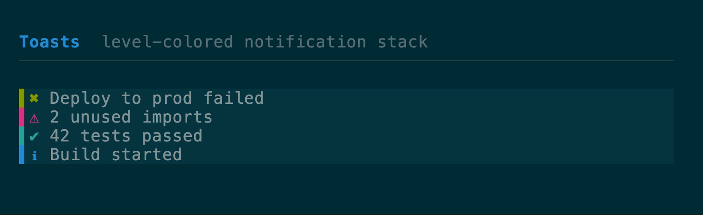
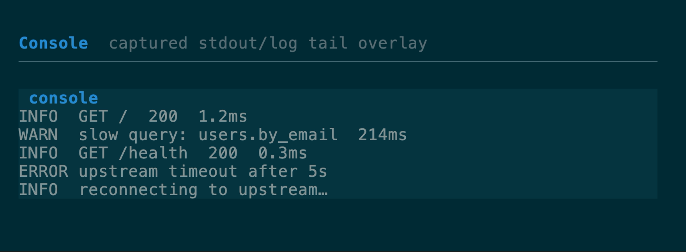

# Notifications & console components

[All components](../components.md)

### `Toasts` + `ToastList`

A transient notification stack with frame-driven expiry: each toast carries a
remaining lifetime in frames, `tick()` decrements them, and one is dropped at
zero. Four severity levels select a semantic accent role and glyph, so one
stylesheet or resolver restyles every notification. Place a `ToastList` in a
corner overlay.
[API](https://docs.rs/tuika/latest/tuika/components/toast/struct.Toasts.html)



```rust
use tuika::{ToastLevel, ToastList, Toasts, view};
let mut toasts = Toasts::new(4);
toasts.push(ToastLevel::Success, "Saved");
toasts.tick(); // once per frame; drops expired toasts
view! { node(ToastList::new(&toasts)) }
```

### `Console` + `ConsoleLog`

Capture `println!`/`tracing` output into a capped ring buffer and show it in a
toggleable overlay. `ConsoleLog` is a cheap, cloneable, `Send`/`Sync` handle that
implements `std::io::Write`, so it drops straight into a logging pipeline; the
`Console` view tails the most recent lines.
[API](https://docs.rs/tuika/latest/tuika/components/console/struct.ConsoleLog.html)



```rust
use tuika::{Console, ConsoleLog, view};
let log = ConsoleLog::new(500);
// tracing_subscriber::fmt().with_writer({ let l = log.clone(); move || l.clone() }).init();
view! { node(Console::new(&log).title(" console ")) }
```

---

[All components](../components.md)
