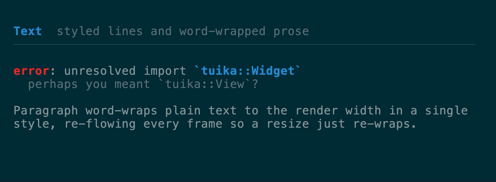
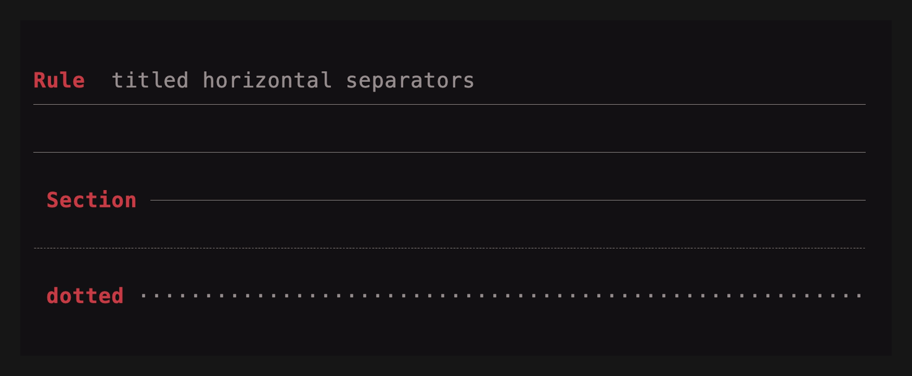

# Text components

[All components](../components.md)

### `Text`

A block of pre-styled [`Line`](https://docs.rs/ratatui)s drawn top-down and
clipped. `Paragraph` word-wraps plain text in one style; `Wrap` word-wraps
pre-styled lines while preserving per-span styles.
[API](https://docs.rs/tuika/latest/tuika/components/text/struct.Text.html)

Horizontal alignment is honored. `Text` and `Wrap` read each `Line`'s
`alignment` (unset = flush-left), so centered titles, right-aligned totals, and
centered empty-state messages built by an existing formatting layer render as
intended; `Wrap` carries a line's alignment onto every reflowed row.
`Paragraph` takes one alignment for the whole block via `.alignment(..)`.



```rust
use ratatui::layout::Alignment;
use ratatui::text::Line;
use tuika::prelude::*;
view! {
    col(gap = 1) {
        // Per-line alignment on pre-styled lines.
        node(Text::new(vec![
            Line::from("flush left"),
            Line::from("centered").centered(),
            Line::from("flush right").right_aligned(),
        ]))
        // One alignment for a wrapped plain-text block.
        node(Paragraph::new("word-wrapped prose", style).alignment(Alignment::Center))
    }
}
```

### `Rule`

A one-row horizontal separator: optional leading title, then a fill glyph out to
the width. [API](https://docs.rs/tuika/latest/tuika/components/struct.Rule.html)



```rust
use tuika::prelude::*;
view! {
    node(Rule::new().title(" Section "))
}
```

---

[All components](../components.md)
