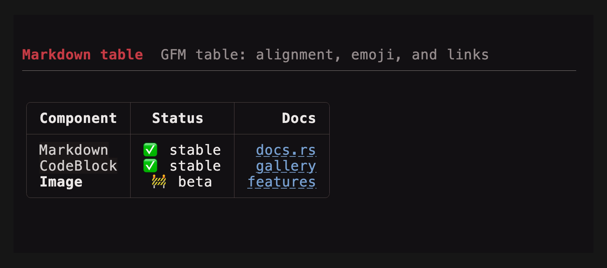
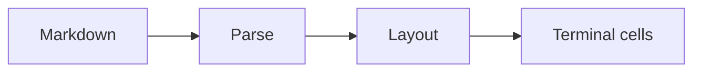
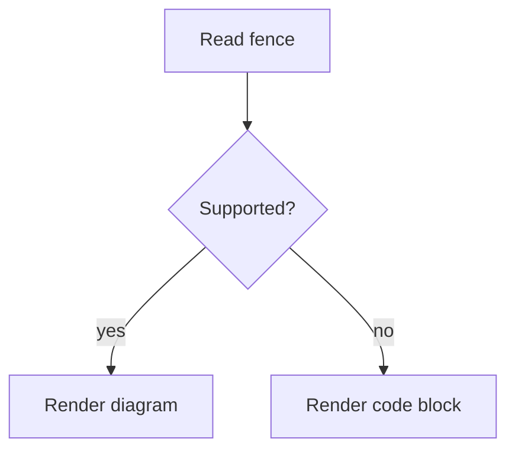
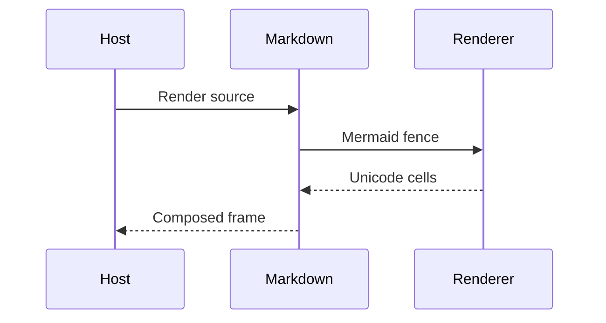

# Markdown in tuika

tuika renders CommonMark (plus GFM tables and strikethrough) straight to styled
terminal lines — no HTML step, no intermediate document model to hold. It is the
component an agent or chat host leans on hardest, so it has more moving parts
than the rest of the [gallery](components.md): a streaming form, width-driven
table layout, a pluggable syntax highlighter, clickable links, and inline images.
This page covers all of it in one place.

- [The two entry points](#the-two-entry-points)
- [What renders](#what-renders)
- [Inline HTML](#inline-html)
- [Block HTML](#block-html)
- [Streaming](#streaming)
- [GFM tables](#gfm-tables)
- [Fenced code](#fenced-code)
- [Extensible fenced blocks](#extensible-fenced-blocks)
- [Links](#links)
- [Images](#images)
- [Styling](#styling)

## The two entry points

`Markdown` is a `View`: hand it a string, place it in a layout, done. It is the
right answer for static markdown — a help panel, a release note, a rendered
`README`.

```rust
use tuika::prelude::*;
view! {
    col(padding = Padding::all(1)) {
        node(Markdown::new("# Title\n\nSome **bold** prose."))
    }
}
```

`MarkdownState` is the streaming form, and the one a transcript wants: it holds
the source, is fed deltas as a message arrives, and hands back styled lines on
demand. `to_lines` is the same renderer as a bare function, for a host that has
neither a layout slot nor a stream.

```rust
use tuika::prelude::*;
let mut md = MarkdownState::new();
md.push_str(delta);                                  // forward each stream delta
let lines = md.lines(width, &theme, &sheet, CodeHighlighter::Plain);
view! { node(tuika::components::Text::new(lines)) }
```

Lines come out already wrapped to the width you passed. Draw them **without**
further wrapping — tuika's `Text`, or ratatui's `Paragraph` with no `.wrap` —
or code indentation and table borders will be re-flowed into nonsense.

## What renders

| Construct | Notes |
| :-------- | :---- |
| Headings | `#`–`######`; bold + themed, italic from `###` down |
| Emphasis | `**bold**`, `*italic*`, `~~strikethrough~~`, `` `inline code` `` |
| Lists | Bullet and ordered, nested (2 columns per level), markers themed |
| Task lists | `- [ ]` / `- [x]`, checkbox painted as a themed marker |
| Block quotes | Indented per level of nesting |
| Thematic breaks | `---` as a themed rule |
| Fenced code | Verbatim, with a language label and an optional highlighter |
| Tables | GFM pipe tables, boxed and fitted to the width |
| Links | Label painted, destination emitted as an OSC 8 hyperlink |
| Images | `` — real pixels via a host resolver, alt text otherwise |
| Inline HTML | A whitelist of presentational tags — see [below](#inline-html) |

Every one of these is measured in *cells*, not chars, so wide CJK glyphs and
multi-scalar emoji keep the layout honest.

## Inline HTML


Markdown in the wild carries HTML, so the presentational inline tags render
instead of disappearing:

| Tag | Renders as |
| :-- | :--------- |
| `<b>` `<strong>` | the `strong` role |
| `<i>` `<em>` `<var>` `<cite>` `<dfn>` | the `emphasis` role |
| `<code>` `<kbd>` `<samp>` `<tt>` | the `inline_code` role |
| `<s>` `<del>` `<strike>` | the `strikethrough` role |
| `<u>` `<ins>` | underlined |
| `<mark>` | reverse video |
| `<a href>` | the `link` role, destination kept for OSC 8 / Ctrl+click |
| `` | the same path as ``, resolver and all |
| `<br>` | a line break (a space inside a table cell) |
| `<sub>` `<sup>` | Unicode subscript / superscript — `H<sub>2</sub>O` → `H₂O` |

Because each tag resolves a [`StyleSheet`](styling.md) role rather than a color,
restyling `strong` restyles `<b>` with it.

Everything else — `<div>`, `<details>`, `<script>`, block-level HTML, and any
attribute not listed above — is dropped, never printed as literal markup. tuika
does not parse HTML: this is a fixed tag whitelist, so untrusted markdown cannot
reach anything but these styles. Unbalanced tags (`<b>` with no `</b>`, a stray
`</i>`) degrade quietly, and no tag styles past the block it opened in.

`<sub>`/`<sup>` transliterate only when *every* character has a Unicode form —
digits and `+ - = ( )`. `4<sup>th</sup>` renders `4th` rather than half-shifted.

## Block HTML

`<div>`, `<details>`, `<table>` — block-level HTML is a *seam* rather than a
feature, for the same reason syntax highlighting is: an HTML parser is a
dependency tuika will not carry. Without a renderer attached the block is
dropped, exactly as before the seam existed, so adding one is purely additive.


The `<details>` above, the `<ul>` nested in it, and the `<table>` are all raw
HTML in an otherwise ordinary markdown document.
[`tuika-html`](https://crates.io/crates/tuika-html) is the ready-made renderer;
one value serves both block HTML and ` ```html ` fences:

```rust
use tuika::prelude::*;
use tuika_html::HtmlRenderer;

let html = HtmlRenderer::new();
let doc = Markdown::new("<details><summary>Notes</summary>Body</details>")
    .html_renderer(&html)
    .block_renderer(&html);
# let _ = doc;
```

A streaming host attaches it once, with
`MarkdownState::with_html_renderer(Box::new(HtmlRenderer::new()))`; a settled
block is then laid out once per width, like a fenced block.

Implementing the seam yourself means `HtmlBlockRenderer`: it receives the raw
run, the available width, the theme, and the active `StyleSheet` — so headings,
links, and code resolve the same roles the surrounding markdown does. Returning
`None` drops the block.

One framing detail is worth knowing, because it looks like a bug: pulldown-cmark
ends an HTML block at a blank line, so an element whose content is separated by
blank lines reaches the renderer as several independent blocks. Keep an
element's markup contiguous and it lays out as one.

For HTML that is not inside markdown at all, the same crate ships the
[`Html`](components.md#html) component.

## Streaming


A transcript re-renders on every delta, which is exactly the workload a naive
renderer is worst at. `MarkdownState` splits the source at the last **stable
block boundary** — a blank line outside an open code fence — and re-parses only
the in-flight tail. Everything before it is parsed and highlighted once and
cached, so a long conversation does not re-tokenize, and a settled code block is
not handed back to the highlighter, on each frame.

The cache holds *width-independent* parsed blocks. Layout — wrapping, table
column fitting, code framing — is recomputed each frame from the width you pass,
so the same state tracks the viewport as the terminal resizes; there is nothing
to invalidate by hand.

## GFM tables



Pipe tables render with box-drawing borders, a bold header, and per-column
alignment taken from the `:---:` markers. Cells keep their inline styles — bold,
inline code, links, emoji — and are measured grapheme-aware, so a wide emoji
advances two columns and the borders stay square.

```rust
use tuika::prelude::*;
let doc = Markdown::new("\
| Component   |  Status   |                          Docs |
| :---------- | :-------: | ----------------------------: |
| `Markdown`  | ✅ stable | [docs.rs](https://docs.rs/tuika) |
| **Image**   |  🚧 beta  | [features](https://github.com/everruns/tuika) |
");
# let _ = doc;
```

Column widths come from the content, then the whole table is fitted to the
available width: the widest column is shrunk first, wrapping its cells, and the
rest keep their natural size. Below `4 * cols + 1` columns even that cannot fit,
so the box is dropped for ` | `-joined rows that word-wrap:

```text
Wide area — a fitted grid.          Very narrow — boxless fallback.
╭───────────┬────────┬──────────╮   Component | Status | Docs
│ Component │ Status │     Docs │   Markdown | stable | docs.rs
├───────────┼────────┼──────────┤   Image | beta | features
│ Markdown  │ stable │  docs.rs │
│ Image     │  beta  │ features │
╰───────────┴────────┴──────────╯
```

Because the fit is width-driven and re-run per frame, one source covers every
terminal size — the host never pre-formats a table for the pane it lands in.

## Fenced code


A fenced block is emitted **verbatim** — indentation is meaningful, so it is
never word-wrapped — and framed by the same renderer as the standalone
[`CodeBlock`](components.md#codeblock) component: language label, left rail, code
background.

Syntax coloring comes from a `Highlighter` you supply, because grammars are far
too heavy to live in tuika:

```rust
use tuika::prelude::*;
view! { node(Markdown::new(source).highlighter(&highlighter)) }
```

Without one, code is themed but uncolored. The `tuika-codeformatters` crate ships
a tree-sitter implementation covering the common languages; a host with its own
lexer implements the two-method trait instead.

## Mermaid diagrams

`FencedBlockRenderer` can replace a language fence with terminal-native,
width-aware lines. A renderer returns `None` for languages or inputs it does not
handle, preserving the normal themed code block. The companion
[`tuika-mermaid`](https://crates.io/crates/tuika-mermaid) crate supplies an
mmdflux-backed renderer for `mermaid` fences:

```rust
use tuika::prelude::*;
use tuika_mermaid::MermaidRenderer;

let source = "```mermaid\nflowchart LR\n  Parse --> Layout --> Paint\n```";
let mermaid = MermaidRenderer::new();
let doc = Markdown::new(source).block_renderer(&mermaid);
# let _ = doc;
```

The renderer understands Mermaid flowcharts. For example, a left-to-right
pipeline:

````markdown

````

A top-down decision flow with labeled branches:

````markdown

````

And a sequence diagram showing the rendering handoff:

````markdown

````

All three are ordinary Markdown source; registering `MermaidRenderer` turns them
into Unicode diagrams sized for the available terminal width. Unsupported
syntax, malformed input, and fences over 64 KiB remain visible as ordinary
themed code blocks instead of disappearing.

Here are the flowchart and sequence diagram rendered by the runnable integration
example:


Run it from the workspace root with
`cargo run -p tuika-mermaid --example mermaid_markdown`.

## Links

A `[label](url)` paints the label in the theme's link style and emits the
destination as an [OSC 8 hyperlink](features.md#hyperlinks-osc-8) — clickable in
terminals that support it, plain styled text everywhere else. Bare URLs in prose
are linked in place.

`link_policy` decides which schemes are emitted:

```rust
use tuika::prelude::*;
use tuika::term::hyperlink::LinkPolicy;
// Default: http(s) only. `NONE` styles labels but emits no OSC 8 —
// for a host that handles clicks itself, or wants links inert.
view! { node(Markdown::new(source).link_policy(LinkPolicy::NONE)) }
```

Since markdown is usually model- or user-authored, the policy is a real security
boundary, not a preference: it is what stops a `file://` or `javascript:` URL in
untrusted text from becoming a clickable target. `LinkPolicy::WEB.with_mailto()`
opts `mailto:` back in where a host wants it.

## Images

`` renders as a real image where the terminal has a graphics protocol.
Markdown carries only the URL, so — exactly like the highlighter seam — the host
supplies the decode through an `ImageResolver`; a resolved image reserves a block
in the layout, an unresolved one stays an inline, link-styled placeholder rather
than dropping the URL.

```rust
use tuika::prelude::*;
view! { node(Markdown::new(source).images(&resolver, support, &layer)) }
```

A host driving `MarkdownState::lines` itself reads `MarkdownState::images()` and
paints each `MarkdownImage` at its `rect(area)`. See
[Images](features.md#images-kitty-iterm2--sixel-graphics-protocols) for the
protocols and the alt-text fallback.

## Styling

Every markdown element resolves its look through the active `StyleSheet` —
`heading`, `strong`, `emphasis`, `strikethrough`, `list_marker`, `link`, and the
`CodeTheme` slots behind fenced code — so markdown inherits the app's
[theme](themes.md) and [stylesheet](styling.md) instead of carrying colors of its
own. Restyling the app restyles the transcript.

## See also

- [Component gallery](components.md) — every component, with a demo each.
- [Terminal features](features.md) — hyperlinks, images, and the rest of the
  out-of-band terminal surface.
- [API documentation](https://docs.rs/tuika/latest/tuika/components/markdown/index.html)
  — `Markdown`, `MarkdownState`, `to_lines`, `ImageResolver`.
- [Runnable example](../examples/markdown.rs) — `cargo run --example markdown`
  streams a document in a real terminal.
