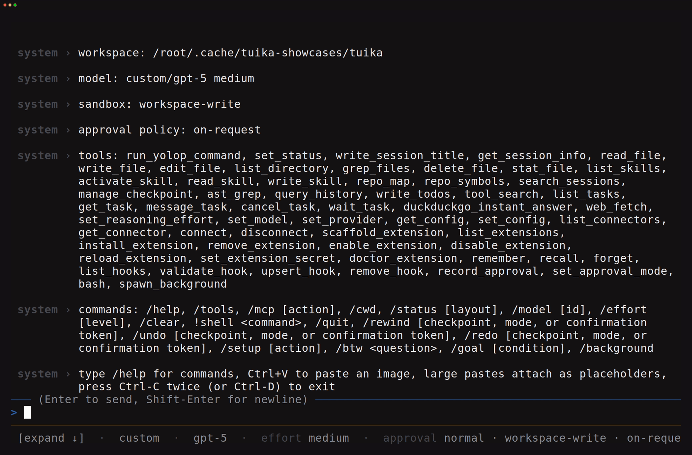
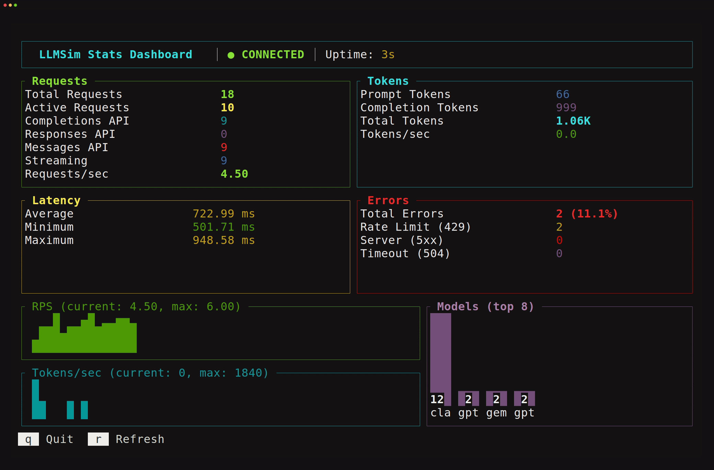
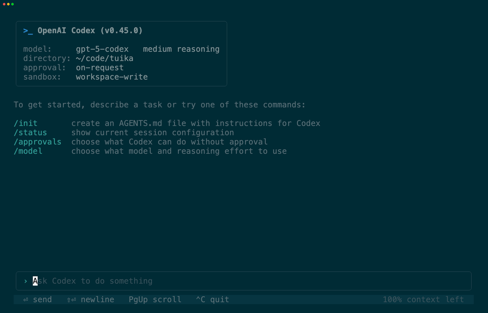

# Built with tuika

Applications whose terminal UI is built on tuika — what they are, and what the
toolkit looks like once it is carrying a real product. At the end,
[one in-repo example](#codex-cli-replica-in-repo-example) that reproduces a
well-known agent UI rather than shipping a product of its own.

Building something on tuika? Open a PR adding it here.

## yolop

A terminal coding agent that plans, edits, runs, and verifies code in your
repository: persistent sessions, agent skills, MCP servers, and editor
integration over the Agent Client Protocol. Its full-screen renderer is built on
tuika — the transcript, the streaming markdown and highlighted code, the tool
cards, the composer, and the status footer are all tuika components under
tuika's layout and host loop.

[everruns.com/yolop](https://everruns.com/yolop) ·
[github.com/everruns/yolop](https://github.com/everruns/yolop)

The recorded session is deterministic and offline — the model is a local
[LLMSim](#llmsim) replaying a scripted turn — so the recording shows the real
agent loop without a provider key.

## LLMSim

An LLM traffic simulator: a local server that speaks the OpenAI, OpenResponses,
and Anthropic APIs with realistic streaming, latency profiles, token accounting,
and injected failures, so load tests and CI runs never touch a real model. Its
`serve --tui` stats dashboard is a tuika screen — the panel grid is flexbox
layout, and the counters, sparklines, and model distribution redraw live while
requests are in flight.

[github.com/chaliy/llmsim](https://github.com/chaliy/llmsim) ·
[crates.io](https://crates.io/crates/llmsim)

The dashboard above is under ~5 requests/second across four models, with rate
limit and server-error injection turned on.

## Codex CLI replica (in-repo example)

> **This is a replica, not Codex.** It is an example in *this* repository that
> reproduces the look and interaction shape of OpenAI's Codex CLI on tuika. It is
> not the Codex CLI, it is not built or endorsed by OpenAI, and no part of Codex
> is used or included. "Codex" and "OpenAI" are their owners' marks, referenced
> here only to say what the UI imitates.
>
> Nothing behind the interface is real: there is no model, no network, and no
> shell. A turn is a scripted sequence chosen from the prompt's keywords and
> revealed frame by frame, so the recording below is deterministic and offline.

Why it exists: a component gallery shows one widget at a time, and an agent CLI
is the hardest shape to get right from parts — a transcript of heterogeneous
history items that must scroll as one, a composer whose `/` and `@` change what
the keyboard means, a modal escalation prompt, and answers that stream in while
the user scrolls. Building it surfaced two gaps that became
[`ItemScroll`](components.md#itemscroll) and the
[composer token seams](components.md#inline-tokens-mentions-commands-anything).

[`examples/codex/`](../examples/codex) · `cargo run --example codex`

The example prints its frames as text too — `cargo run --example codex -- --dump`
— which is how its layout is checked without a recorder.
