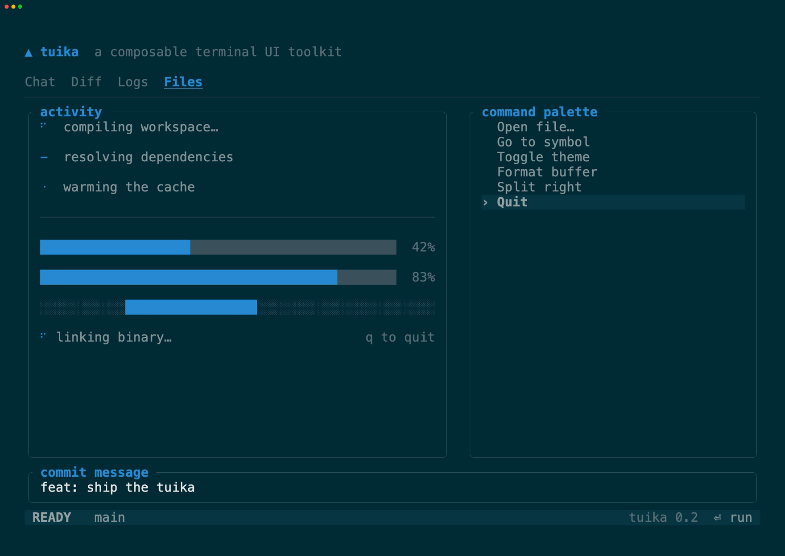
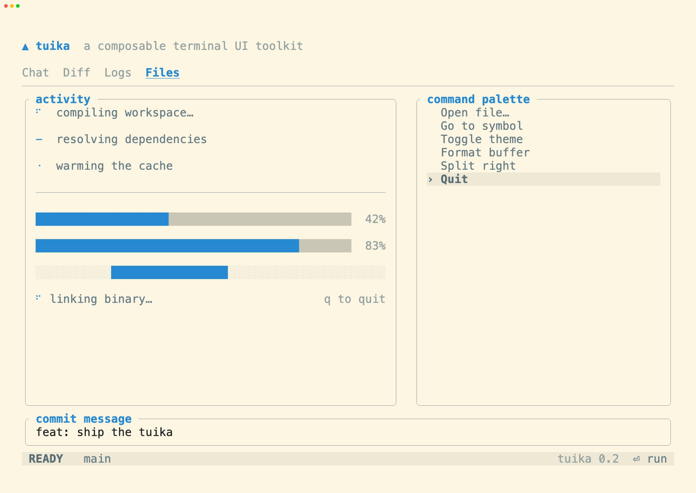
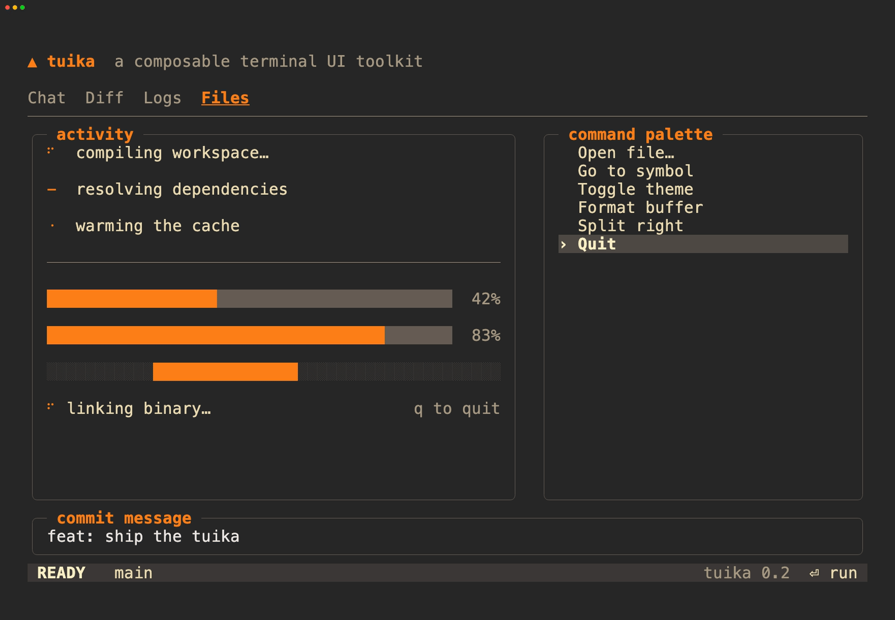
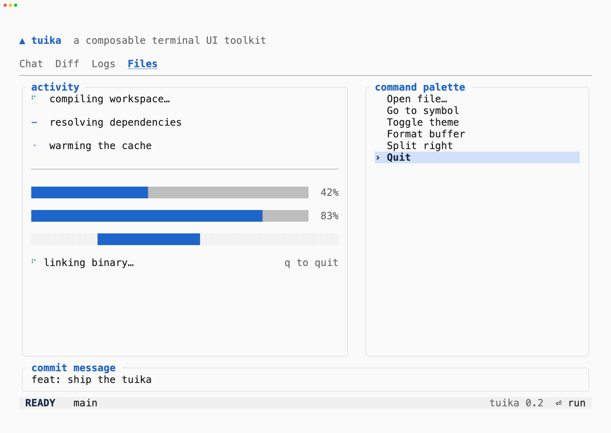
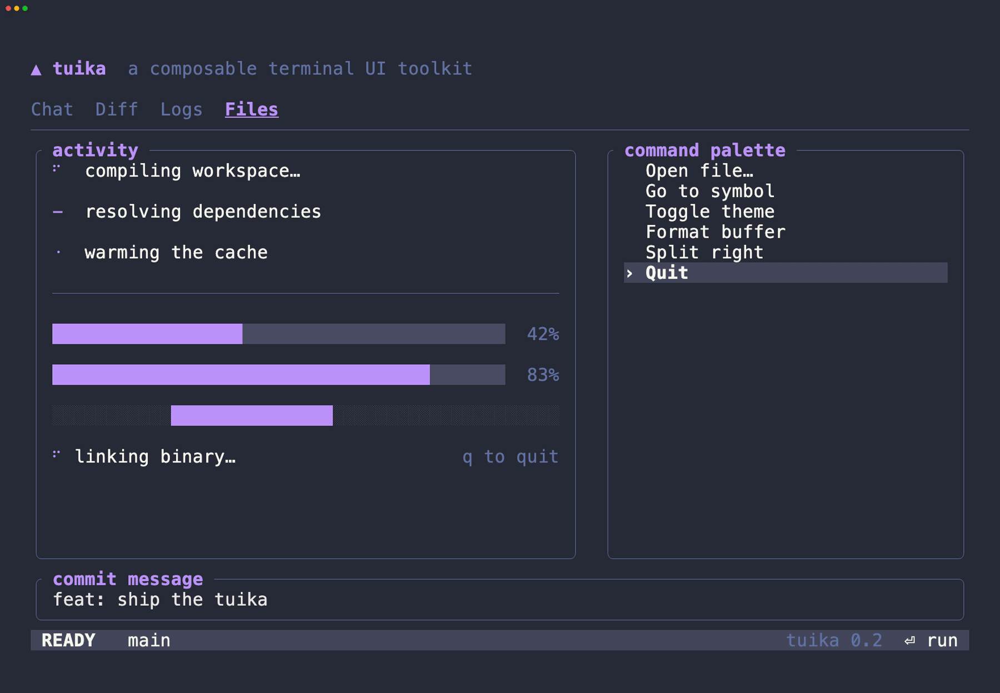

# Themes

Every tuika component styles itself from a [`Theme`](https://docs.rs/tuika/latest/tuika/style/struct.Theme.html)
passed through the render context — no component hard-codes a color. Swapping
the theme handed to [`paint`](https://docs.rs/tuika/latest/tuika/host/fn.paint.html)
restyles the whole tree at once.

A `Theme` is a plain `Copy` struct of colors, so a palette is just data. tuika
bundles a few standard palettes as full `const Theme` structures in the
[`themes`](https://docs.rs/tuika/latest/tuika/themes/index.html) module. Reach
one directly, by constructor, or by name:

```rust
use tuika::themes;

let a = themes::GRUVBOX_DARK;            // the struct
let b = tuika::Theme::gruvbox_dark();    // named constructor
let c = tuika::themes::by_name("gruvbox-dark").unwrap(); // config / --theme
assert_eq!(a, b);
assert_eq!(a, c);
```

Iterate [`themes::PRESETS`](https://docs.rs/tuika/latest/tuika/themes/constant.PRESETS.html)
to build a picker or validate a `--theme` value — each entry carries a stable
`name`, a human `label`, and the `theme` itself.

Each demo below is the **same** animated scene (the component gallery from
[`examples/screenshot.rs`](../examples/screenshot.rs)) driven through that one
palette — an honest side-by-side of what a theme does to real components,
recorded the same way as the [component gallery](components.md):

```text
scripts/gen-theme-demos.sh          # all themes
scripts/gen-theme-demos.sh dracula  # just one
```

## `solarized-dark`

Ethan Schoonover's precision palette on the dark base tones.
[struct](https://docs.rs/tuika/latest/tuika/themes/constant.SOLARIZED_DARK.html)



## `solarized-light`

The same accents on Solarized's light base tones — the light half of the pair.
[struct](https://docs.rs/tuika/latest/tuika/themes/constant.SOLARIZED_LIGHT.html)



## `gruvbox-dark`

morhetz's warm, retro-tinted dark palette (medium contrast).
[struct](https://docs.rs/tuika/latest/tuika/themes/constant.GRUVBOX_DARK.html)



## `light`

A neutral, near-monochrome palette for light terminals — the understated light
default, not a brand.
[struct](https://docs.rs/tuika/latest/tuika/themes/constant.LIGHT.html)



## `dracula`

The widely-ported dark theme — purple/pink accents on a slate background.
[struct](https://docs.rs/tuika/latest/tuika/themes/constant.DRACULA.html)



## `terminal`

The one preset with no colors of its own. Every slot is `Color::Reset` or a
`Color::Indexed` ANSI slot, so the **terminal** resolves the palette — the app
adopts whatever the user already configured, with no query and no failure mode.
[struct](https://docs.rs/tuika/latest/tuika/themes/constant.TERMINAL.html)

It has no recording here for the same reason it has no colors: what it looks like
is whatever terminal you run it in, so a GIF of it would only ever be a picture
of the recorder's palette. Run it yourself instead:

```text
cargo run --example inherit
```

Because ANSI has no tone between two slots, the raised and faint roles collapse
(`surface` reads as the background; `dim`, `border`, and `muted` all land on
bright black). To keep those distinct, ask the terminal for its actual colors and
derive them — `Theme::from_terminal` — which is covered in
[terminal features](features.md#inheriting-the-terminals-colors).

## Rolling your own

The bundled palettes are a starting point, not a ceiling. Construct a `Theme`
literal (or clone a preset and tweak a few slots) and every component follows —
that is exactly how yolop builds its own look on top of tuika.

```rust
use tuika::{Theme, themes};

let mine = Theme {
    accent: ratatui::style::Color::Rgb(45, 91, 158),
    ..themes::GRUVBOX_DARK
};
```

## Semantic status styles

Every theme also exposes `success_style`, `warning_style`, `danger_style`, and
`info_style` (or `semantic_style(SemanticRole)`). These derive from the
theme's existing syntax palette, so custom `Theme` struct literals remain
source-compatible and automatically get status colors:

```rust
use tuika::prelude::{SemanticRole, Theme};

let theme = Theme::default();
let error = theme.danger_style();
let notice = theme.semantic_style(SemanticRole::Info);
```

## See also

- [`themes` API](https://docs.rs/tuika/latest/tuika/themes/index.html) — the
  presets, the `NamedTheme` catalog, and `by_name`.
- [component gallery](components.md) — the components these palettes style.
- [README](../README.md) — the model behind the toolkit.
